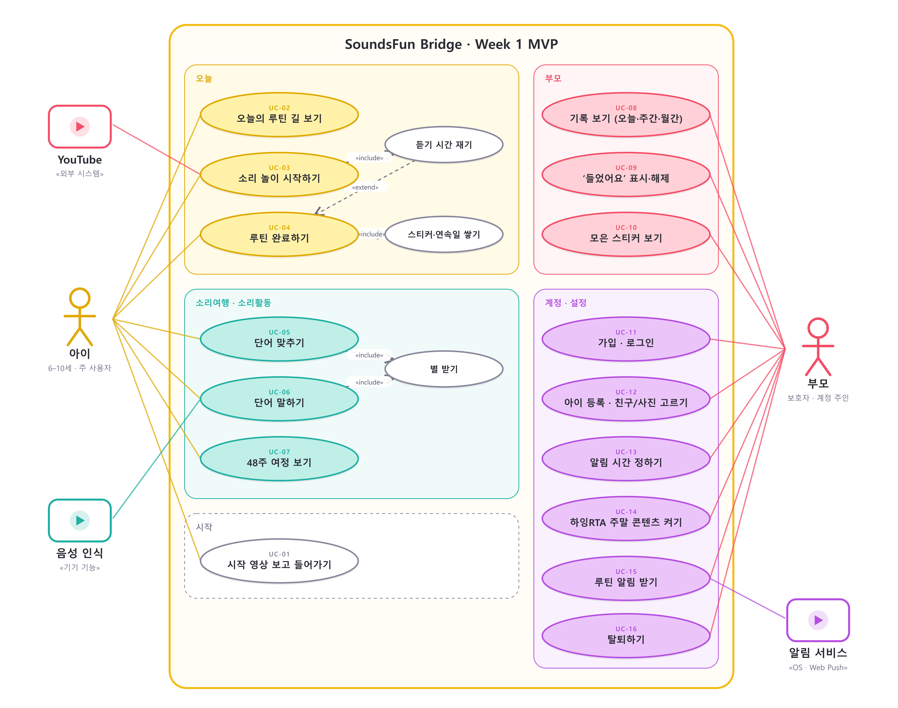

# 유즈케이스 명세서

## 행위자

| 행위자 | 종류 | 설명 |
|---|---|---|
| 아이 | 주 행위자 | 6–10세. 길을 따라 루틴을 하고 소리활동을 한다 |
| 부모 | 주 행위자 | 계정 주인. 등록·설정·확인을 한다. 아이 옆에서 함께 쓰기도 한다 |
| YouTube | 외부 시스템 | 영상을 재생한다 |
| 음성 인식 | 기기 기능 | 아이가 말한 단어를 글자로 바꾼다 |
| 알림 서비스 | 외부 시스템 | 기기 알림(앱) 또는 Web Push(웹) |

## 유즈케이스 다이어그램

| 관계 | 뜻 |
|---|---|
| 소리 놀이 시작하기 «include» 듣기 시간 재기 | 시작하면 항상 시간이 흐른다 |
| 듣기 시간 재기 «extend» 루틴 완료하기 | 목표 시간에 닿으면 자동 완료로 이어진다 |
| 루틴 완료하기 «include» 스티커·연속일 쌓기 | 완료는 언제나 보상으로 이어진다 |
| 단어 맞추기·말하기 «include» 별 받기 | 맞히거나 통과하면 별 |

## 유즈케이스 목록

| ID | 이름 | 행위자 | 관련 요구사항 |
|---|---|---|---|
| UC-01 | 시작 영상 보고 들어가기 | 아이 | FR-101 |
| UC-02 | 오늘의 루틴 길 보기 | 아이 | FR-301–308 |
| UC-03 | 소리 놀이 시작하기 | 아이, YouTube | FR-401–403 |
| UC-04 | 루틴 완료하기 | 아이 | FR-404–407 |
| UC-05 | 단어 맞추기 | 아이 | FR-502–505 |
| UC-06 | 단어 말하기 | 아이, 음성 인식 | FR-506–508 |
| UC-07 | 48주 여정 보기 | 아이 | FR-501 |
| UC-08 | 기록 보기 | 부모 | FR-601–605, 608 |
| UC-09 | ‘들었어요’ 표시·해제 | 부모 | FR-606–607 |
| UC-10 | 모은 스티커 보기 | 부모 | FR-608 |
| UC-11 | 가입·로그인 | 부모 | FR-102–104 |
| UC-12 | 아이 등록·친구/사진 고르기 | 부모 | FR-201–204 |
| UC-13 | 알림 시간 정하기 | 부모 | FR-701, 703 |
| UC-14 | 하잉RTA 주말 콘텐츠 켜기 | 부모 | FR-704 |
| UC-15 | 루틴 알림 받기 | 부모, 알림 서비스 | FR-702 |
| UC-16 | 탈퇴하기 | 부모 | FR-105 |

## UC-01 시작 영상 보고 들어가기

| 항목 | 내용 |
|---|---|
| 시작 조건 | 앱을 연다 |
| 끝난 뒤 | 로그인 전이면 로그인, 아이가 없으면 아이 등록, 아니면 오늘 탭 |

1. 시작 영상이 소리 없이 재생되고 “화면을 눌러 시작해요”가 보인다.
2. 아이가 화면을 누른다.
3. 영상이 사라지고 다음 화면이 나타난다.

- 1a. 소리 버튼을 누르면 영상 소리가 켜진다.
- 1b. 영상을 불러오지 못하면 멈춘 그림을 보여 주고 그대로 진행한다.

## UC-02 오늘의 루틴 길 보기

| 항목 | 내용 |
|---|---|
| 시작 조건 | 아이가 등록되어 있다 |
| 끝난 뒤 | 오늘 할 루틴과 상태를 안다 |

1. 인사 카드와 오늘 진행(완료 수, 분, 막대)을 본다.
2. 1번부터 번호가 붙은 정거장이 길로 이어져 있다. 정거장마다 캐릭터, 이름, 분이 있다.
3. 끝낸 정거장은 완료 표시가 붙고, 거기까지의 길이 색칠되어 있다.
4. 아래로 내리면 다음 3일의 길이 작게 보인다.

- 2a. 주말이고 하잉RTA가 켜져 있으면 5·6번 정거장이 더 있다.
- 2b. 시작일 전이면 길 대신 시작 날짜 안내가 나온다.
- 2c. 7일이 끝났으면 마침 안내가 나온다.

## UC-03 소리 놀이 시작하기

| 항목 | 내용 |
|---|---|
| 시작 조건 | 오늘의 정거장을 눌렀다 |
| 끝난 뒤 | 유튜브가 열렸고 듣기 시간이 흐른다 |

1. 루틴 시트가 올라온다: 이름, 목표 분, 안내 한 줄, 오늘의 한 문장.
2. “소리 놀이 시작”을 누른다.
3. 유튜브(앱 또는 새 탭)에서 영상이 열린다.
4. 앱은 시작 시각을 기록하고 시간을 잰다.

- 2a. 주말 콘텐츠는 영상 하나가 아니라 재생목록이 열린다.
- 4a. 멈춤을 누르면 지금까지의 시간이 쌓이고 멈춘다. 이어 듣기로 다시 흐른다.
- 4b. 앱을 닫았다 열어도 시작 시각에서 이어서 계산한다.

## UC-04 루틴 완료하기

| 항목 | 내용 |
|---|---|
| 시작 조건 | 루틴 시트가 열려 있거나 시간이 흐르는 중이다 |
| 끝난 뒤 | 기록에 완료 방식과 시각이 남고 스티커가 1장 늘었다 |

1. 듣기 시간이 목표 분에 닿는다.
2. 앱이 루틴을 완료로 바꾼다 (`timer`).
3. 축하 표시가 뜨고, 길의 정거장이 완료로 바뀐다.

- 1a. 아이(또는 부모)가 “오늘 완료했어요”를 누르면 바로 완료된다 (`manual`). 목표 분이 기록된다.
- 3a. 오늘의 마지막 루틴이면 하루를 마친 축하를 보여 준다.
- 이미 완료한 루틴은 다시 완료되지 않고 되돌릴 수도 없다.

## UC-05 단어 맞추기

| 항목 | 내용 |
|---|---|
| 시작 조건 | 소리여행 탭에서 소리활동을 눌렀다 |
| 끝난 뒤 | 문제별 정답 여부와 걸린 시간이 남는다 |

1. 단어 소리가 나온다. 다시 듣기 버튼이 있다.
2. 보기 중 하나를 고른다.
3. 맞으면 별과 칭찬, 틀리면 정답을 알려 준다. 화면 높이는 변하지 않는다.
4. 8문제를 마치면 단어 말하기로 간다.

- 2a. 짝 맞추기는 그림과 단어를 모두 이으면 끝난다.
- 연령 6세는 글자 없이 그림만, 보기 수도 적다.

## UC-06 단어 말하기

1. 단어 그림과 소리가 나온다.
2. 마이크 버튼을 누르고 말한다.
3. 음성 인식 결과와 단어를 비교해 0.7 이상이면 통과, 별 1개.
4. 통과하지 못하면 한 번 더. 그래도 안 되면 정답 소리를 들려 주고 넘어간다.

- 2a. 마이크 권한이 없거나 브라우저가 지원하지 않으면 도움 모드: 부모가 “잘 말했어요”를 누른다 (`passByParent`).
- 2b. 건너뛰기를 누르면 `skipped`로 남는다.

## UC-08 기록 보기

1. 부모 탭을 연다. 요약 네 칸이 보인다.
2. 오늘·주간·월간을 고른다.
3. 주간은 루틴 × 요일 표, 월간은 달력이다. 이전·다음으로 옮긴다.
4. 아래에서 이번 주 루틴별 완료와 모은 스티커를 본다.

## UC-09 ‘들었어요’ 표시·해제

| 항목 | 내용 |
|---|---|
| 시작 조건 | 주간 표에서 오늘이나 지난 칸을 눌렀다 |
| 끝난 뒤 | 그 칸이 부모 표시로 완료되었거나 표시가 지워졌다 |

1. 빈 칸을 누르면 “들었어요로 표시할까요?”가 뜬다.
2. 표시하기를 누르면 그 루틴이 `parent` 완료로 저장되고 목표 분이 더해진다.

- 1a. 부모가 표시한 칸을 누르면 “표시를 지울까요?”가 뜬다. 지우면 기록이 사라진다.
- 1b. 앱에서 완료한 칸은 “앱에서 완료한 기록은 지울 수 없어요”라고 알려 준다.
- 1c. 미래 칸, 시작일 이전 칸, 평일의 주말 루틴 칸은 눌리지 않는다.

## UC-11 가입·로그인

1. 이메일, 비밀번호, 비밀번호 확인을 넣고 필수 항목에 동의한다.
2. 가입하기를 누르면 아이 등록으로 간다.

- 1a. 이메일 형식, 8자 미만, 비밀번호 불일치는 칸 아래에 알려 준다.
- 2a. 이미 가입한 이메일이면 로그인으로 갈지 묻는다.

## UC-12 아이 등록·친구/사진 고르기

1. 이름, 연령, 학습 시작일을 넣는다.
2. 친구 네 마리 중 하나를 고르거나 사진을 고른다.
3. 시작하기를 누르면 기본 알림 시각이 만들어지고 오늘 탭으로 간다.

- 2a. 사진은 정사각형으로 잘라 256px로 줄인 뒤 기기에만 저장한다.
- 2b. 사진 권한이 없으면 기기 설정에서 허용하라고 알려 준다.

## UC-13 알림 시간 정하기

1. 설정에서 알림을 켠다. 처음이면 기기 권한을 묻는다.
2. 알림 시간에서 루틴별 시각을 10분 단위로 바꾼다.
3. 저장하면 앞으로의 알림이 새 시각으로 다시 잡힌다.

## UC-14 하잉RTA 주말 콘텐츠 켜기

1. 스위치를 켠다.
2. “주말에 추가할까요?” 확인 창에서 추가하기를 누른다.
3. 토·일의 길과 부모 표에 찬양·바이블 스토리가 생긴다. 평일은 그대로다.

## UC-15 루틴 알림 받기

1. 정한 시각이 되면 알림 서비스가 “○○ 시간이에요”를 보낸다.
2. 알림을 누르면 앱이 열리고 그 루틴 시트가 뜬다.

- 1a. 이미 끝낸 루틴이면 알림을 보내지 않는다.
- 1b. 저녁 8시에 남은 루틴이 있으면 한 번 더 알려 준다.

## UC-16 탈퇴하기

1. 설정에서 탈퇴를 누르고 확인한다.
2. 기기의 계정·아이·기록을 지우고 로그인 화면으로 간다.
3. 서버가 연결되어 있으면 `DELETE /me`로 계정과 딸린 모든 행이 함께 지워진다(CASCADE).
