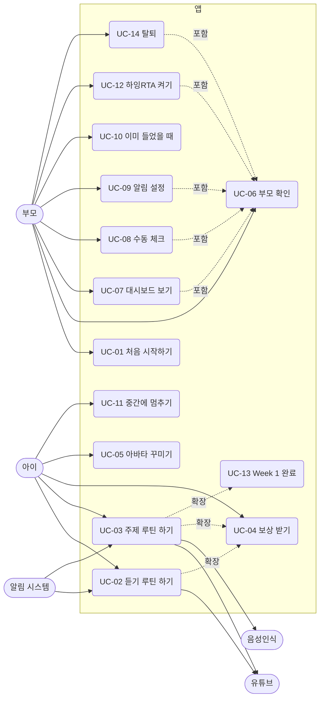

# 유즈케이스 명세서

## 행위자

| 행위자 | 설명 |
|---|---|
| 아이 | 주 사용자. 6~10세. 코스 맵과 레슨 화면을 쓴다. 글을 못 읽을 수 있다 |
| 부모 | 계정 주인. 부모 확인을 거쳐 대시보드·설정을 쓴다 |
| 알림 시스템 | 정해진 시각에 알림을 보낸다 |
| 유튜브 | 외부. 영상 재생을 담당 |
| 음성인식 | 기기 내장 또는 서버. 아이 발화를 글자로 바꾼다 |

## 유즈케이스 다이어그램

## UC-01 처음 시작하기

| 항목 | 내용 |
|---|---|
| 행위자 | 부모 |
| 사전 조건 | 앱 첫 실행 |
| 트리거 | 앱 아이콘 탭 |
| 사후 조건 | 계정·아이 프로필·루틴 시각 저장, Day 1 열림 |

기본 흐름
1. 앱 소개 3장을 넘긴다 (A0)
2. “시작하기” → 가입 화면 (A2). 이메일·비밀번호 입력, 필수 동의 체크
3. 가입 완료, 자동 로그인
4. 아이 별명·연령대 입력, 아바타 꾸미기 또는 사진 (A3)
5. 루틴 시각 4개 확인·수정, 시작일 선택 (A4)
6. 알림 허용 (A5)
7. 홈(H1)에서 첫 방문 가이드 G-H1 표시

대안 흐름
- 2a. 이미 있는 이메일 → 팝업 D-02 “로그인할까요?”
- 4a. 사진 권한 거부 → 아바타 꾸미기만 가능, 토스트 T-04
- 6a. 알림 거부 → 홈 상단 배너 B-01, 설정에서 재시도
- 6b. iOS 웹 → 홈 화면 추가 안내 D-05 먼저

## UC-02 듣기 루틴 하기 (아침·저녁·잠자리)

| 항목 | 내용 |
|---|---|
| 행위자 | 아이 (부모가 틀어줌) |
| 사전 조건 | 로그인, 오늘 Day 열림, 해당 루틴 미완료 |
| 트리거 | 알림 탭 또는 홈에서 노드 탭 |
| 사후 조건 | 루틴 완료, 듣기 분 기록, 스티커·별 지급 |

기본 흐름
1. 시작 시트 L0: 영상·시간·부모 한 줄 가이드
2. “시작” → L1. “유튜브에서 틀기” 탭
3. 시작 시각 저장, 유튜브가 열린다
4. 20분 경과 → 진동·소리, 백그라운드면 알림 N-02
5. 앱으로 돌아와 “다 들었어요” 탭
6. 완료 화면 L4: 스티커·별, 오늘 진행 갱신

대안 흐름
- 2a. 유튜브가 안 열림 → L1의 “다시 열기”, 그래도 실패 시 “브라우저로 열기”
- 4a. 목표 전에 “먼저 넘어가기” → UC-06 부모 확인 → 들은 분 선택 D-11 → 수동 기록
- 5a. 앱을 껐다가 다음 날 열면 → 진행 폐기, 노드는 ‘놓침’
- 6a. 오늘 4개째 → 하루 완료 연출 (UC-04)

## UC-03 주제 루틴 하기 (집중듣기)

| 항목 | 내용 |
|---|---|
| 행위자 | 아이 + 부모 함께 |
| 사전 조건 | UC-02와 같음 |
| 사후 조건 | 3단계 완료, 퀴즈·말하기 결과 기록 |

기본 흐름
1. L0 → L1: 유튜브 열고 30분 타이머 (UC-02 2~5와 같음)
2. L2 단어 맞추기 8문항. 첫 방문이면 음성 가이드 G-L2
3. 문항마다 정답·오답 피드백, 별 적립
4. 결과 화면 → “계속”
5. L3 단어 말하기 4단어. 첫 방문이면 G-L3
6. 단어마다 듣기 → 마이크 → 판정
7. L4 완료 화면

대안 흐름
- 2a. 중간에 X → D-10 “그만할까요?” → 홈. 푼 문항 저장, 노드 ‘진행중’
- 6a. 두 번 미달 → “잘 들었어요!”로 통과
- 6b. 마이크 권한 없음·미지원 → 부모가 들어주기 모드 (D-12)
- 6c. “건너뛰기” → 기록 skipped

## UC-04 보상 받기

| 항목 | 내용 |
|---|---|
| 행위자 | 아이 |
| 트리거 | 단계·루틴·하루·주 완료 |

| 시점 | 보상 | 연출 |
|---|---|---|
| 단계 완료 | 별 | 상단 카운트 +N 튕김 |
| 루틴 완료 | 스티커 1장 (루틴 종류별 그림) | L4에서 붙는 모션, 캐릭터 축하 |
| 하루 4개 완료 | 하루 배지, 연속일수 +1 | 컨페티 1회, 연속 불꽃 커짐 |
| Day 7 완료 | 주간 트로피 | 트로피 화면, “한 번 더” 노드 등장 |

## UC-05 아바타 꾸미기

| 항목 | 내용 |
|---|---|
| 행위자 | 아이 (부모와) |
| 진입 | 온보딩 A3, 설정 S2, 홈 아바타 길게 누르기 |

기본 흐름
1. 아바타 편집기 A3-1: 미리보기 + 부위 탭 (피부·머리·머리색·눈·입·안경·배경)
2. 부위별 옵션 그리드에서 고르면 즉시 반영
3. “랜덤” 버튼으로 무작위 조합
4. “저장” → 홈 상단·보상 화면 반영

대안 흐름
- 1a. “내 사진” 탭 → 사진 선택 → 원형 자르기 → 테두리 장식 5종 중 선택 → 저장
- 1b. 사진 권한 거부 → 토스트 T-04

## UC-06 부모 확인

| 항목 | 내용 |
|---|---|
| 행위자 | 부모 |
| 사전 조건 | 부모 전용 동작 요청 (대시보드·설정·수동 체크·먼저 넘어가기) |
| 사후 조건 | 10분간 부모 모드 |

기본 흐름
1. 게이트 시트 G1: “부모님이 3초 눌러주세요” + 원형 게이지 버튼
2. 3초 길게 누르면 게이지가 차고 통과
3. 요청한 화면으로 이동

대안 흐름
- 2a. 중간에 손을 떼면 게이지 초기화, 문구 “조금만 더요”
- 2b. 10분 안에 다시 요청 → 게이트 없이 통과

## UC-07 대시보드 보기

| 항목 | 내용 |
|---|---|
| 행위자 | 부모 |
| 사전 조건 | 부모 확인 |

기본 흐름
1. 부모 탭 → P1. 요약 카드(오늘 진행, 연속일수, 이번 주, 총 시간)
2. 주간 루틴표 확인. 주 이동
3. 월간으로 전환, 날짜 탭 → 일별 상세 시트 D-20
4. 통계 섹션: 루틴별 완료율, 단어 정답률, 말하기 시도

## UC-08 수동 체크

| 항목 | 내용 |
|---|---|
| 행위자 | 부모 |
| 사전 조건 | 부모 모드, 대상 날짜가 오늘 이하 |

기본 흐름
1. 주간 루틴표의 빈칸 탭
2. 팝업 D-21 “들었어요로 표시할까요?” → 확인
3. 칸이 수동 체크(연한 색)로 바뀜, 이벤트 기록

대안 흐름
- 1a. 수동 체크 탭 → D-22 “표시를 지울까요?” → 해제
- 1b. 자동 체크 탭 → 토스트 T-20 “앱에서 완료한 기록은 지울 수 없어요”
- 1c. 미래 날짜 → 비활성, 탭 무반응

## UC-09 알림 설정

기본 흐름
1. 설정 → 알림. 루틴 4줄 각각 시각·스위치
2. 시각 탭 → 시간 선택기 D-30 → 저장
3. 앱: 로컬 예약 갱신. 웹: 서버 스케줄 갱신
4. “알림 테스트” → 10초 뒤 테스트 알림

대안 흐름
- 1a. 권한 없음 → 상단 “알림 켜기” 버튼 → 시스템 권한 → 거부 시 D-31 (설정 앱 안내)

## UC-10 이미 들었을 때 (TV·다른 기기)

기본 흐름
1. L0에서 “이미 들었어요” 탭
2. UC-06 부모 확인
3. 듣기 단계 수동 완료. 듣기 루틴이면 바로 L4, 주제 루틴이면 L2로

## UC-11 중간에 멈추기

1. L1·L2·L3의 X 또는 “오늘은 여기까지”
2. D-10 확인 → 홈. 진행 저장, 노드 ‘진행중’
3. 같은 날 다시 열면 그 단계부터

## UC-12 하잉RTA 켜기

1. 설정 → 주말 코스 스위치
2. D-40 “찬양·바이블 스토리가 토·일 코스에 추가돼요” → 확인
3. 토·일 Day에 노드 2개 추가 (찬양율동, 바이블 스토리). 평일 무변화

## UC-13 Week 1 완료

1. Day 7 네 번째 루틴 L4 → 트로피 화면 L5
2. 홈 맵 끝에 “Week 1 한 번 더” 노드
3. 탭하면 Day 1부터 재시작 (기록은 별도 회차로 저장)

## UC-14 탈퇴

1. 설정 → “데이터 모두 삭제하고 탈퇴”
2. UC-06 부모 확인
3. D-50: “삭제”를 입력해야 버튼 활성
4. 계정·기록·사진·알림 구독 즉시 삭제 → 로그인 화면
