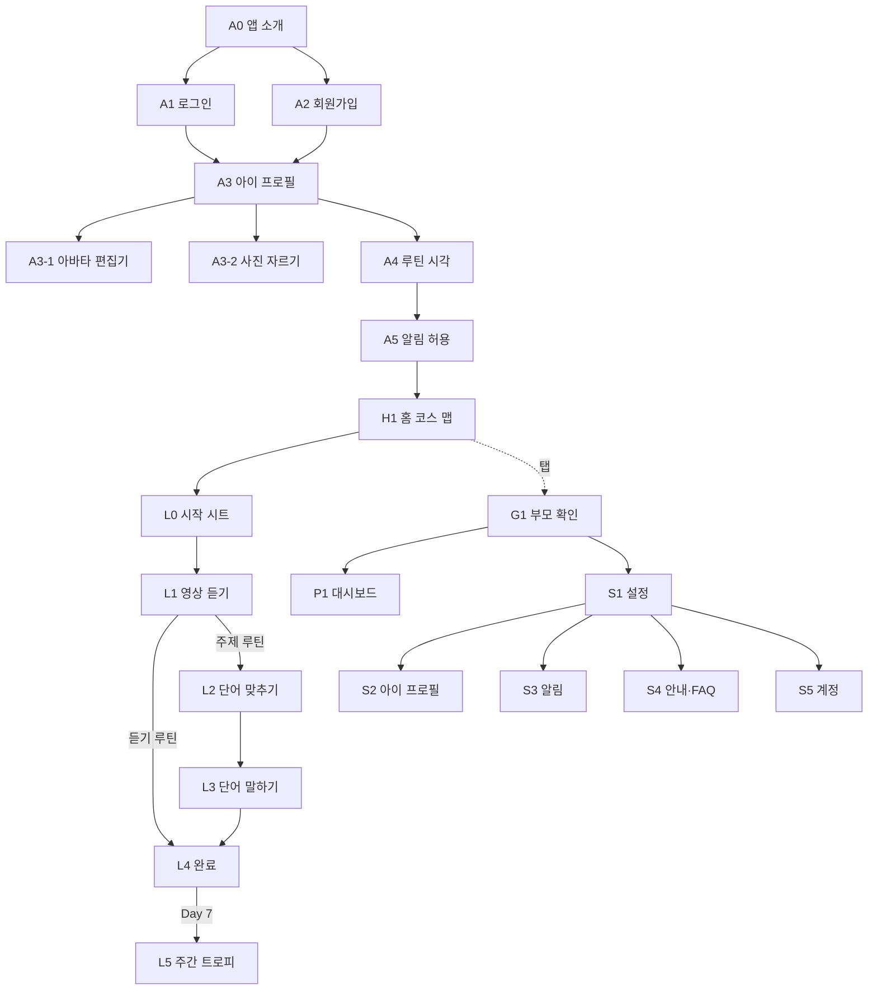

# 화면 명세서

ID 규칙: **A** 온보딩 · **H** 홈 · **L** 레슨 · **P** 부모 대시보드 · **S** 설정 · **G** 게이트 · **N** 알림. 팝업·가이드 ID(D·G·T·B)는 05 문서.

아이 화면 글자 규칙: 제목 한 줄(≤ 12자), 버튼은 아이콘 + 두 글자 이내, 안내는 음성으로. 부모 화면: 16pt 이상, 한 줄에 하나, 전문 용어 없음.

## 탭 구조

| 탭 | 화면 | 사용자 | 게이트 |
|---|---|---|---|
| 🏠 홈 | H1 코스 맵 | 아이 | 없음 |
| 📋 부모 | P1 대시보드 | 부모 | 부모 확인 |
| ⚙ 설정 | S1 설정 | 부모 | 부모 확인 |

레슨(L)은 탭 위에 전체화면으로 뜬다.

## 흐름도

---

## A0 앱 소개

| 항목 | 내용 |
|---|---|
| 목적 | 첫 실행에 “하루 4번, 틀어주기만” 을 그림으로 설명 |
| 진입 | 첫 실행. 이후엔 설정 S4에서 다시 보기 |
| 사용자 | 부모 |

| 구성 | 사용자가 하면 | 결과 |
|---|---|---|
| 슬라이드 3장 (그림 + 한 줄) ① 하루 90분 소리 환경 ② 아침·주제·저녁·잠자리 ③ 아이는 놀고, 부모는 틀어주기만 | 좌우 스와이프 | 점 표시 이동. 마지막 장에서 버튼이 “시작하기” |
| “시작하기” | 탭 | A2 |
| “이미 계정이 있어요” | 탭 | A1 |

## A1 로그인

| 구성 | 사용자가 하면 | 결과 |
|---|---|---|
| 이메일, 비밀번호(보기 토글) | 입력 후 “로그인” | 성공: 프로필 있으면 H1, 없으면 A3. 실패: 입력칸 아래 빨간 한 줄 “이메일 또는 비밀번호가 맞지 않아요” |
| “비밀번호를 잊었어요” | 탭 | 이메일 입력 시트 → 발송 토스트 T-01 |
| “처음이세요? 가입하기” | 탭 | A2 |
| 로그인 상태 유지 | — | 기본 켜짐. 리프레시 토큰 저장 |

상태: 로딩(버튼 스피너, 입력 잠금) · 네트워크 오류(배너 B-02)

## A2 회원가입

| 구성 | 사용자가 하면 | 결과 |
|---|---|---|
| 이메일, 비밀번호(8자 이상), 확인 | 입력 | 실시간 검증. 조건 미달 시 칸 아래 안내 |
| 동의: [필수] 이용약관 · [필수] 개인정보 · [선택] 알림 | 체크. 항목 텍스트 탭 → 전문 시트 | 필수 2개 체크 시 “가입하기” 활성 |
| “가입하기” | 탭 | 계정 생성 → 자동 로그인 → A3 |
| 중복 이메일 | — | D-02 “이미 가입된 이메일이에요. 로그인할까요?” |

## A3 아이 프로필

| 항목 | 내용 |
|---|---|
| 목적 | 별명·연령대·아바타. 실명·생일 없음 |
| 진입 | 온보딩, 설정 S2 (같은 화면) |

| 구성 | 사용자가 하면 | 결과 |
|---|---|---|
| 아바타 미리보기(큰 원) + “꾸미기” “내 사진” 버튼 | “꾸미기” | A3-1 |
| | “내 사진” | A3-2 |
| 별명 (≤ 8자) | 입력 | 홈·보상 화면에 “OO” 로 사용 |
| 연령대: 6세 · 7세 · 8세 · 9~10세 | 탭 | 퀴즈에서 글자 노출 정도 결정 |
| “다음” (온보딩) / “저장” (설정) | 탭 | 저장 → A4 / S1 |

### A3-1 아바타 편집기

| 구성 | 사용자가 하면 | 결과 |
|---|---|---|
| 상단 큰 미리보기 (SVG) | — | 선택 즉시 반영 |
| 부위 탭: 피부 · 머리 · 머리색 · 눈 · 눈썹 · 입 · 안경 · 귀걸이 · 배경색 | 탭 | 아래 옵션 그리드 전환 |
| 옵션 그리드 (그림 타일, 글자 없음) | 탭 | 선택 표시, 미리보기 갱신 |
| 🎲 랜덤 | 탭 | 무작위 조합 |
| “완료” | 탭 | 옵션 값(JSON) 저장 → A3 |

아바타는 오픈소스 아바타 라이브러리(DiceBear, MIT)의 스타일 하나를 쓰고 옵션 값만 저장한다. 그림 파일을 저장하지 않는다.

### A3-2 사진 자르기

| 구성 | 사용자가 하면 | 결과 |
|---|---|---|
| 갤러리 / 카메라 선택 | 탭 | 시스템 선택기. 권한 거부 → T-04 |
| 원형 마스크 + 핀치 줌·드래그 | 조정 | 얼굴이 원 안에 오게 |
| 테두리 장식 5종 (없음·구름·별·꽃·헤드폰) | 탭 | 미리보기 |
| “완료” | 탭 | 256px 원형으로 잘라 업로드. 안내 한 줄 “사진은 앱 안에서만 보여요” |

## A4 루틴 시각

| 구성 | 사용자가 하면 | 결과 |
|---|---|---|
| 루틴 4줄: 아이콘 · 이름 · 길이 · 시각. 기본 07:30 / 17:30 / 18:30 / 20:30 | 시각 탭 | 시간 선택기 D-30 |
| 순서 검증 | — | 아침 < 주제 < 저녁 < 잠자리 아니면 줄 아래 안내 “주제 집중듣기는 저녁송보다 앞이에요” |
| 시작일 (기본 오늘, 최대 7일 뒤) | 탭 | 날짜 선택기 |
| “다음” | 탭 | 저장 → A5 |

## A5 알림 허용

| 구성 | 사용자가 하면 | 결과 |
|---|---|---|
| 그림 + “시간이 되면 알려드릴게요” + 예시 알림 카드 | “알림 켜기” | 시스템 권한 → 허용: 예약 등록 → H1. 거부: T-05 → H1 (배너 B-01) |
| iOS 웹이면 먼저 D-05 “홈 화면에 추가” 안내 | “추가했어요” | 설치 확인 후 권한 요청 |
| “나중에” | 탭 | H1 (배너 B-01) |

---

## H1 홈 · 코스 맵

| 항목 | 내용 |
|---|---|
| 목적 | 오늘 할 루틴을 아이가 한눈에 보고 누른다 |
| 사용자 | 아이 |
| 첫 방문 | G-H1 (그림 + 음성 “오늘 반짝이는 동그라미를 눌러봐”) |

| 구성 | 사용자가 하면 | 결과 |
|---|---|---|
| 상단 바: 아바타 · 🔥 연속일수 · ⭐ 별 | 아바타 탭 | 튕김 + 캐릭터 인사 음성. 길게 누르면 A3-1 |
| | 🔥 탭 | 연속일수 시트 D-60 (달력 7칸, 불꽃 크기) |
| “지금” 카드: 다음 루틴 아이콘·이름, 남은 시간(부모용 작은 글자), 오늘 진행 링 (분) | 탭 | L0 |
| Day 띠: “Day 3” + 날짜(작게) | — | 지난 Day 회색, 오늘 강조, 미래 자물쇠 |
| 노드 4개/Day (지름 72, 루틴 아이콘) | 열림·진행중 탭 | L0 |
| | 완료 탭 | L0 (다시 하기 / 오늘 스티커 보기) |
| | 잠김 탭 | 흔들림 + 음성 “내일 열려요” |
| | 놓침 탭 | 음성 “지난 건 부모님이 표시해 줄 수 있어요” |
| 오늘 4개 완료 | — | Day 배지 등장, 길이 다음 Day로 그려지는 모션 1회 |
| 알림 꺼짐 배너 B-01 (부모용, 작게) | 탭 | A5 |
| 맵 끝 (Day 7 후) | — | 트로피 자리. 완료 시 “한 번 더” 노드 |

노드 상태

| 상태 | 조건 | 모양 |
|---|---|---|
| 잠김 | 미래 Day | 회색, 자물쇠 |
| 열림 | 오늘, 미시작 | 루틴 색 테두리, 살짝 떠 있는 애니메이션 |
| 진행중 | 오늘, 일부 단계 완료 | 테두리 + 진행 호(arc) |
| 완료 | 완료 | 루틴 색 채움 + ✓ |
| 놓침 | 지난 Day, 미완료 | 점선 회색 |

---

## L0 시작 시트

| 구성 | 사용자가 하면 | 결과 |
|---|---|---|
| 루틴 아이콘 + 이름 + “20분” | — | — |
| 영상 썸네일·제목 (작게) | — | — |
| 단계 점: 듣기 루틴 1개 / 주제 루틴 3개 | — | 완료 단계는 채움 |
| 부모 한 줄 (작게): “등원 준비하면서 틀어주세요” | — | 가이드북 문구 |
| ▶ 시작 (큰 버튼) | 탭 | 첫 미완료 단계로 |
| “이미 들었어요” (작은 링크) | 탭 | G1 → 듣기 수동 완료 → L4 또는 L2 |
| 바깥 탭 / 닫기 | 탭 | 닫힘 |

## L1 영상 듣기

| 항목 | 내용 |
|---|---|
| 목적 | 유튜브 열고 시간 재기 |
| 첫 방문 | G-L1 (부모용: “유튜브에서 틀고 돌아오면 시간이 차 있어요”) |

| 구성 | 사용자가 하면 | 결과 |
|---|---|---|
| 큰 원형 타이머 (남은 분:초), 안에 루틴 아이콘 | — | 시작 시각 기준 계산. 앱 밖에서도 흐름 |
| ▶ “유튜브에서 틀기” | 탭 | 시작 시각 저장 → 유튜브 앱/브라우저 열림 |
| 돌아왔을 때 | — | 경과 반영. 아직 안 열었으면 버튼 그대로 |
| 열기 실패 | — | “다시 열기” / “브라우저로 열기” 버튼 |
| 부모 가이드 카드 (접힘) | 펼침 | 표현 예 3줄 |
| 목표 도달 | — | 진동·소리, 캐릭터 박수, 버튼이 ✓ “다 들었어요” |
| ✓ “다 들었어요” | 탭 | 자동 기록 → 듣기 루틴: L4 / 주제: L2 |
| “먼저 넘어가기” (작은 링크, 목표 전) | 탭 | G1 → D-11 들은 분 선택 → 수동 기록 |
| X | 탭 | D-10 → 홈, 진행 저장 |

## L2 단어 맞추기 (주제 루틴)

| 항목 | 내용 |
|---|---|
| 사용자 | 아이 |
| 첫 방문 | G-L2 음성 “소리를 듣고 맞는 그림을 눌러봐” |
| 글자 | 문항 지시문 없음. 🔊 버튼과 그림만 |

| 구성 | 사용자가 하면 | 결과 |
|---|---|---|
| 상단: X · 진행바 | X | D-10 |
| 유형 A 듣고 그림 고르기: 🔊 + 그림 4 | 🔊 | 단어 음성 (자동 1회 + 재생 가능) |
| | 그림 탭 | 정답: 초록 테두리·효과음·⭐, 아래 초록 결과 띠 “좋아요!” + 계속. 오답: 흔들림·정답 강조·정답 음성, 아래 결과 띠 “정답은 이거예요” + 정답 그림 + 계속 |
| 유형 B 그림 보고 고르기: 큰 그림 + 버튼 2~3 (그림+단어, 6~7세는 탭 시 먼저 읽어줌) | 탭 | 동일 |
| 유형 C 짝 맞추기: 🔊 4 ↔ 그림 4 | 🔊 → 그림 | 맞으면 둘 다 사라짐 |
| 유형 D 문장 듣고 색 찾기: 🔊 “It’s red.” + 색 물건 4 | 탭 | 동일 |
| 결과: 별 N개, 오늘 단어 카드 나열 | “계속” | L3 |

문항 구성(8문항): A×3, B×2, C×1, D×2. 연령대 6~7세는 B에서 글자 대신 그림만.

## L3 단어 말하기 (주제 루틴)

| 항목 | 내용 |
|---|---|
| 첫 방문 | G-L3 음성 “듣고 따라 말해봐. 마이크를 꾹 누르고 말해” |

| 구성 | 사용자가 하면 | 결과 |
|---|---|---|
| 단어 카드: 그림 + 단어 + 🔊, 진행 “2/4” 점 | 🔊 | 음성 재생 |
| 🎤 큰 버튼 | 길게 누름 | 파형 애니메이션, 녹음 → 인식 → 판정 |
| 판정 통과 | — | 캐릭터 “멋져요!” 음성, ⭐, 다음 카드 |
| 판정 미달 1회 | — | “한 번 더?” 음성, 카드 그대로 |
| 미달 2회 | — | “잘 들었어요!” 통과 |
| 마이크 불가 | — | 부모 들어주기 모드 D-12: 아이가 말하면 부모가 ✓ |
| “건너뛰기” (작게) | 탭 | 다음 카드, skipped |
| 마지막 카드 후 | — | L4 |

## L4 완료

| 구성 | 사용자가 하면 | 결과 |
|---|---|---|
| 캐릭터 축하 + 스티커 1장 붙는 모션 | — | 자동 |
| 별 합계, 오늘 진행 링 (예: 60/90) | — | — |
| 하루 4개째: “오늘 다 했어!” 배지 + 연속 +1 + 컨페티 | — | 1회 |
| “홈으로” | 탭 | H1, 노드 완료 모션 |

## L5 주간 트로피 (Day 7)

| 구성 | 사용자가 하면 | 결과 |
|---|---|---|
| 트로피 + 스티커 28장 모자이크 + 캐릭터 | — | 음성 “일주일 다 했어!” |
| “홈으로” | 탭 | H1, “한 번 더” 노드 |

---

## G1 부모 확인

| 구성 | 사용자가 하면 | 결과 |
|---|---|---|
| 시트: “부모님이 3초 눌러주세요” + 원형 게이지 버튼 | 3초 길게 | 통과, 10분 유지 |
| | 중간에 뗌 | 게이지 초기화, “조금만 더요” |
| 닫기 | 탭 | 요청 취소 |

---

## P1 부모 대시보드

| 항목 | 내용 |
|---|---|
| 목적 | 오늘 상황과 한 주·한 달 기록을 한 화면에 |
| 첫 방문 | G-P1 (3장: 요약·루틴표·수동 체크) |
| 글자 | 16pt 이상, 숫자는 큰 글자, 한 카드에 하나 |

| 구성 | 사용자가 하면 | 결과 |
|---|---|---|
| 요약 4카드: 오늘 40/90분 · 🔥 연속 5일 · 이번 주 18/28 · 총 6시간 20분 | — | — |
| 🔥 카드 | 탭 | D-60 연속일수 시트 |
| 보기 전환: 주간 · 월간 (세그먼트) | 탭 | 아래 영역 전환 |
| 주간 루틴표: 4행 × 7열, 칸 = ✓(진함, 자동) · ✓(연함, 수동) · 빈칸 · 오늘(테두리) · 미래(회색) | 빈칸 탭 | D-21 → 수동 체크 |
| | 수동 ✓ 탭 | D-22 → 해제 |
| | 자동 ✓ 탭 | T-20 |
| 주 이동 ‹ › | 탭 | 시작일 이전·미래 주는 비활성 |
| 월간 달력: 날짜마다 점 0~4, 4개면 채움 | 날짜 탭 | D-20 일별 상세 |
| 통계 카드 3: 루틴별 완료율 (막대 4) · 단어 정답률 · 말하기 시도/통과 | — | 이번 주 기준 |
| 스티커판 | 스티커 탭 | 툴팁 “9/17 아침송” |
| 바로가기: 알림 시간 · 아이 프로필 | 탭 | S3 · S2 |
| 데이터 없음 | — | “오늘 첫 루틴을 하면 여기에 쌓여요” + 홈 버튼 |

---

## S1 설정

| 구성 | 사용자가 하면 | 결과 |
|---|---|---|
| 아이 카드: 아바타 · 별명 · 연령대 · “Day 3” | 탭 | S2 |
| 알림: 전체 스위치 + 루틴 4줄 (시각 · 스위치) | 탭 | S3 |
| 주말 코스: “하잉RTA 신앙 콘텐츠” 스위치 (기본 꺼짐) + 한 줄 설명 | 켜기 | D-40 확인 |
| 안내: 소리노출 가이드 · 자주 묻는 질문 · 앱 소개 다시 보기 · 가이드 팝업 다시 보기 · 문의 | 탭 | S4 |
| 계정: 이메일 · 비밀번호 변경 · 로그아웃 | 탭 | S5 |
| 데이터 모두 삭제하고 탈퇴 (빨간 글자) | 탭 | D-50 |
| 버전 · 개인정보처리방침 | — | — |

### S2 아이 프로필 = A3 (저장 버튼)
### S3 알림 = A4 + 스위치 + “알림 테스트 보내기” + 저녁 리마인드 스위치
### S4 안내·FAQ: 가이드북 요약, FAQ 3문항, 문의(메일 링크)
### S5 계정: 비밀번호 변경(현재·새·확인), 로그아웃 D-51

---

## N1 알림

| 종류 | 시각 | 제목 · 본문 | 탭 |
|---|---|---|---|
| N-01 루틴 | 설정 시각, 미완료일 때만 | ☀ 아침송 시간이에요 · Good Morning Mr. Rooster 20분 | H1 + L0 열림 |
| N-02 타이머 완료 | L1 목표 도달, 백그라운드 | 20분 다 들었어요 ✓ · 돌아와서 스티커 받기 | L1 |
| N-03 저녁 리마인드 | 20:00, 미완료 있을 때 | 오늘 2개 남았어요 · 잠자리 스토리로 마무리해요 | H1 |
| N-04 테스트 | 요청 10초 후 | 알림이 잘 와요 🎧 | S3 |
