# 화면 명세서

시안(SF 폴더 11장)과 같게 만들었습니다. 아래 그림은 시안이 아니라 **만들어진 앱의 실제 화면**입니다. 값(색·간격·글꼴)은 09 디자인 가이드에 있습니다.

## 화면 목록

| ID | 화면 | 시안 | 경로 |
|---|---|---|---|
| S0 | 시작 영상 | 00 Splash | (모든 화면 위) |
| A1 | 로그인 | – | `/login` |
| A2 | 가입 | – | `/signup` |
| A3 | 아이 등록 | – | `/onboarding` |
| T1 | 오늘 | 01 오늘 | `/today` |
| T2 | 루틴 시트 | 05A–D 팝업 | 오늘 위 시트 |
| J1 | 소리여행 | 02 소리여행 | `/journey` |
| J2 | 소리활동 | – | `/activity` |
| P1 | 부모 · 오늘 | 03A | `/parent` |
| P2 | 부모 · 주간 | 03B | `/parent` |
| P3 | 부모 · 월간 | 03C | `/parent` |
| C1 | 설정 | 04 설정 | `/settings` |
| C2 | 아이 정보 · 알림 시간 · 안내 | – | `/manage/*` |

## 흐름

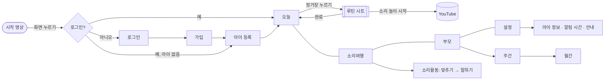

## 공통

| 항목 | 내용 |
|---|---|
| 틀 | 폭 430 이하는 화면 가득, 그보다 넓으면 가운데에 폰 틀(최대 430)과 옅은 배경 |
| 탭 막대 | 아래에 떠 있는 막대(높이 76, 모서리 27, 좌우 12). 오늘·소리여행·부모·설정 |
| 시트 | 아래에서 올라오는 창(모서리 32). 밖을 누르거나 아래로 내려 닫는다 |
| 알림 띠 | 저장·완료 같은 짧은 알림은 화면 위에 잠깐 |
| 글 | 큰 제목은 빙그레체, 그 밖은 Pretendard |

## S0 시작 영상

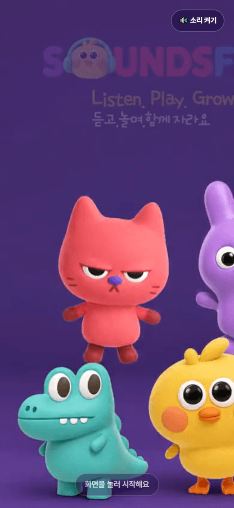

| 요소 | 동작 |
|---|---|
| 영상 | 디자이너가 준 6초 영상. 소리 없이 자동 재생, 반복 |
| 안내 | “화면을 눌러 시작해요” — 부드럽게 깜빡인다 |
| 소리 버튼 | 오른쪽 위. 누르면 소리 켜기·끄기 |
| 화면 누르기 | 영상이 사라지고 앱으로 들어간다 |

## A1 · A2 · A3 계정과 아이 등록

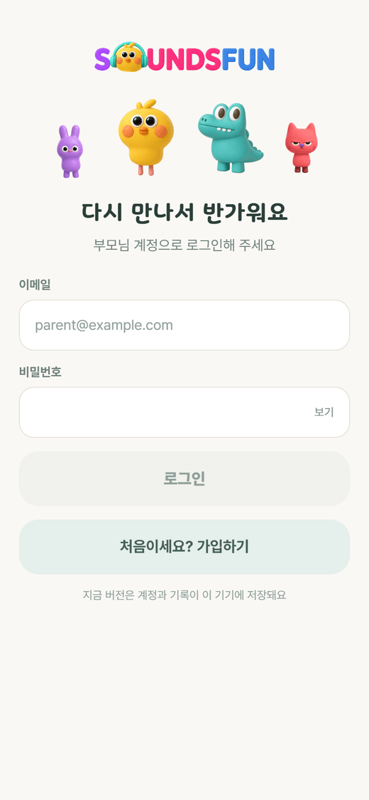
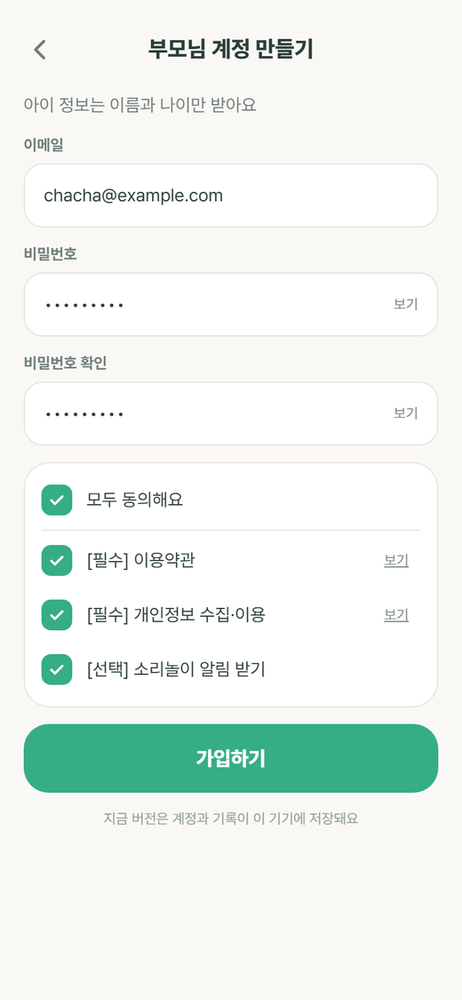
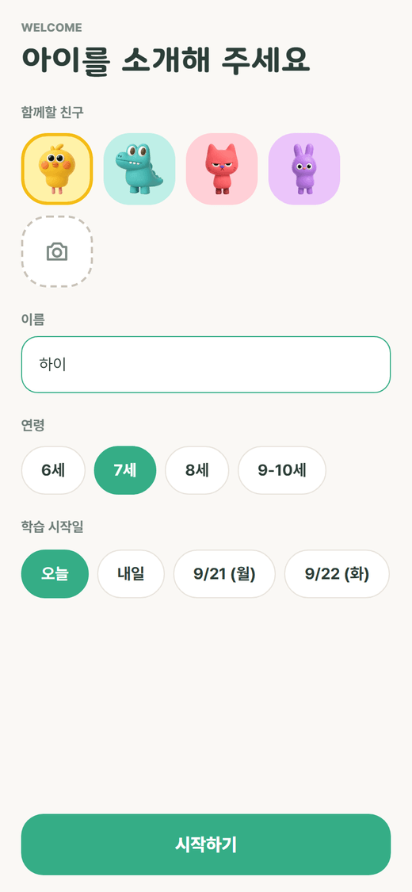

| 화면 | 입력 | 검사 |
|---|---|---|
| 로그인 | 이메일, 비밀번호(보기·숨기기) | 틀리면 “이메일 또는 비밀번호가 맞지 않아요” |
| 가입 | 이메일, 비밀번호, 확인, 동의 3개(모두 동의) | 형식, 8자 이상, 일치, 필수 동의 |
| 아이 등록 | 이름, 연령 4개 중 하나, 시작일(오늘·내일·날짜), 친구 4종 또는 사진 | 이름은 비울 수 없다 |

## T1 오늘

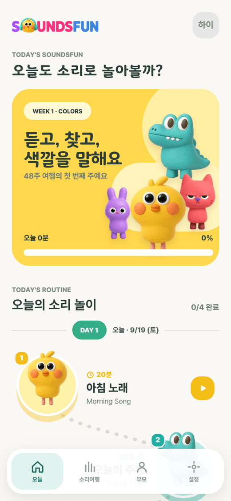
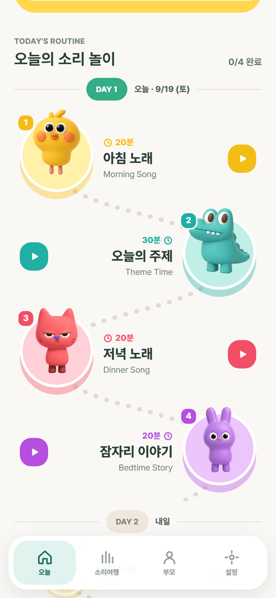
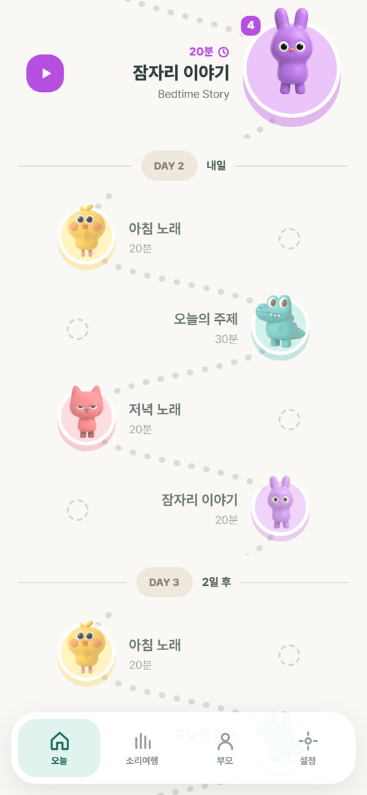

| 구역 | 내용 |
|---|---|
| 머리 | 날짜, “오늘”, 연속일 알약 |
| 인사 카드 | 노랑 카드(높이 298, 모서리 30). 이름, `WEEK 1 · Colors`, 캐릭터 넷이 시안 위치에서 둥실거린다 |
| 오늘 진행 | `1 / 4`, `20 / 90분`, 막대 |
| **루틴 길** | 시안의 TODAY’S ROUTINE 목록을 대신하는 새 디자인 |

### 루틴 길 규칙

| 규칙 | 값 |
|---|---|
| 정거장 배치 | 1번 왼쪽, 2번 오른쪽 … 번갈아. 세로 간격 일정 |
| 정거장 모양 | 루틴 색의 둥근 돌(아래쪽이 조금 더 진함) 위에 캐릭터. 왼쪽 위에 번호 동그라미 |
| 이름표 | 루틴 이름, 영어 이름, 분, 재생 버튼. 정거장 반대쪽에 놓인다 |
| 길 | 정거장을 잇는 점선 곡선(SVG). 완료한 구간은 루틴 색 실선 |
| 완료 | 정거장에 체크, 이름표에 “완료” |
| 날짜 알약 | 길 위에 `DAY 1 · 오늘`. 다음 날은 `DAY 2` … |
| 다음 3일 | 작게, 흐리게, 점선 동그라미. 눌리지 않는다 |
| 좌표 계산 | `pathLayout.ts`의 순수 함수. 화면 폭에 맞춰 다시 계산되고 단위 테스트가 있다 |

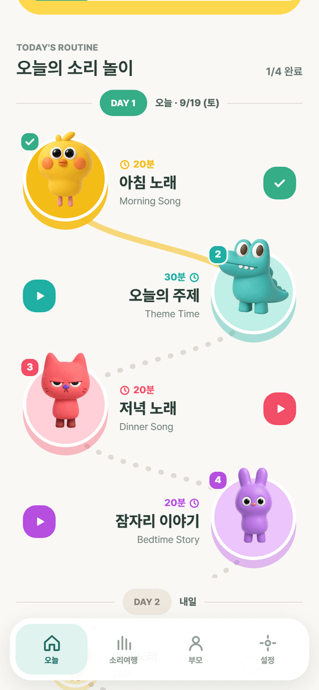

## T2 루틴 시트

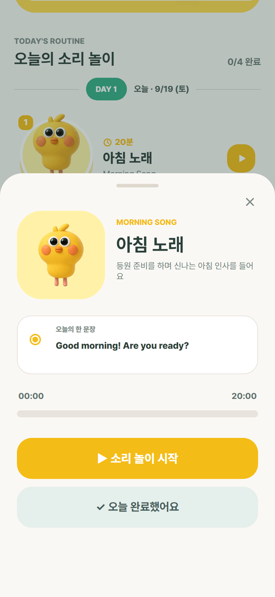

| 요소 | 내용 |
|---|---|
| 타일 | 루틴 색 배경, 캐릭터, 이름·영어 이름·분 |
| 안내 | 한 줄. 예: “등원 준비를 하며 신나는 아침 인사를 들어요” |
| 오늘의 한 문장 | 예: `Good morning! Are you ready?` |
| 시간 막대 | `00:00 / 20:00`. 흐르는 중에는 멈춤 버튼 |
| ▶ 소리 놀이 시작 | 유튜브를 열고 시간을 잰다 (높이 58, 모서리 21) |
| ✓ 오늘 완료했어요 | 바로 완료. 목표 분이 기록된다 |
| 완료 상태 | 버튼 대신 완료 표시와 “다시 듣기” |

## J1 소리여행

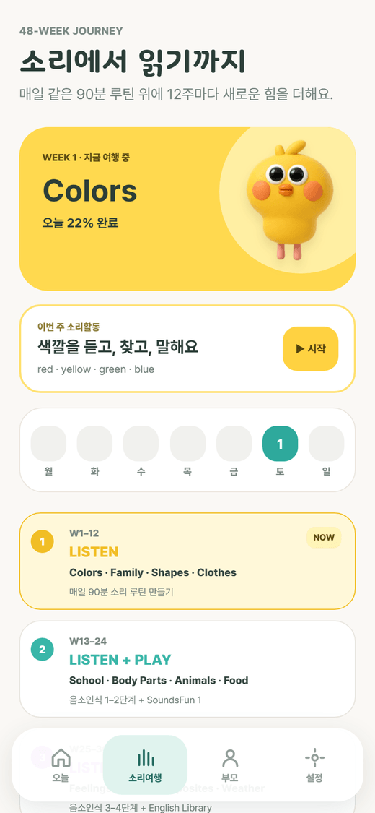
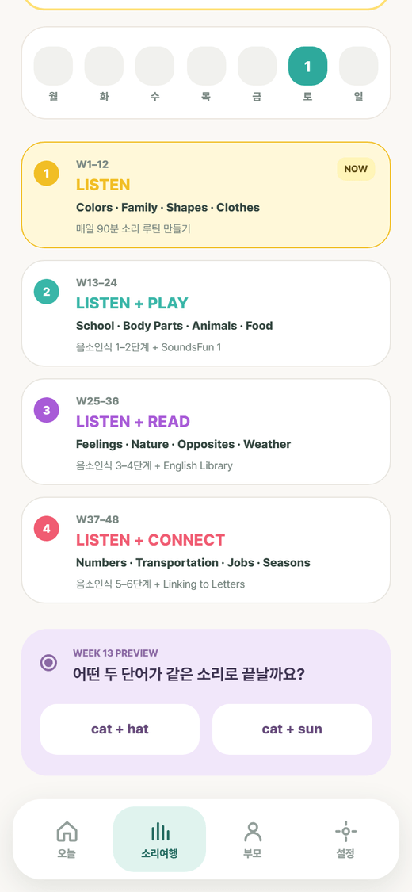

| 구역 | 내용 |
|---|---|
| 이번 주 카드 | `WEEK 1`, Colors, “듣고, 찾고, 색깔을 말해요” |
| 소리활동 카드 | “색깔을 듣고, 찾고, 말해요” → J2 |
| 요일 줄 | 월~일. 한 날은 색이 찬다. 오늘은 테두리 |
| 48주 단계 | LISTEN → LISTEN + PLAY → LISTEN + READ → LISTEN + CONNECT. 지금 단계 강조 |
| 13주 미리보기 | “어떤 두 단어가 같은 소리로 끝날까요?” 보기 2개, 눌러 보면 답을 알려 준다 |

## J2 소리활동

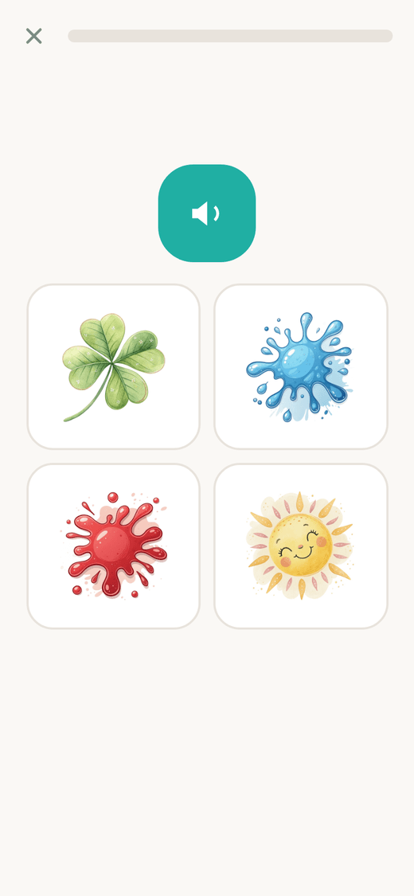
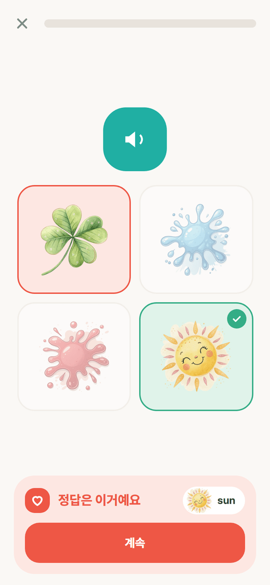

| 단계 | 내용 |
|---|---|
| 맞추기 | 위에 진행 점, 소리 버튼, 아래에 보기 타일. 고르면 아래 고정된 자리에 결과가 뜬다(화면이 밀리지 않는다) |
| 말하기 | 큰 그림, 단어, 마이크 버튼. 듣는 동안 물결. 결과는 통과·한 번 더·정답 듣기 |
| 도움 모드 | 마이크를 못 쓰면 “잘 말했어요” 버튼 |
| 마침 | 받은 별, 다시 하기, 돌아가기 |

## P1 · P2 · P3 부모

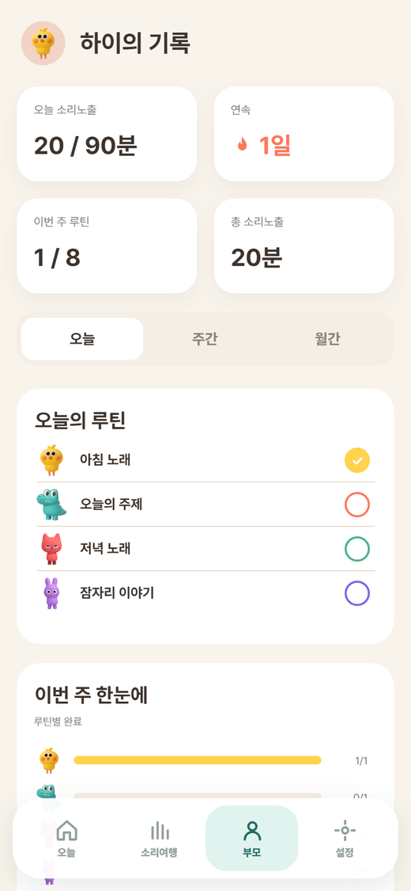
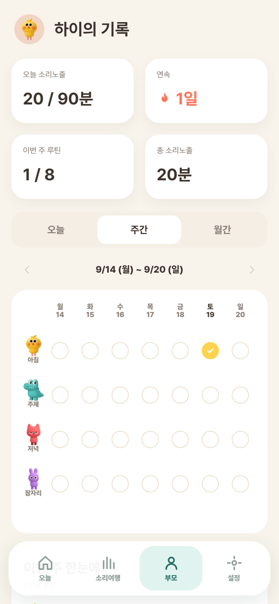
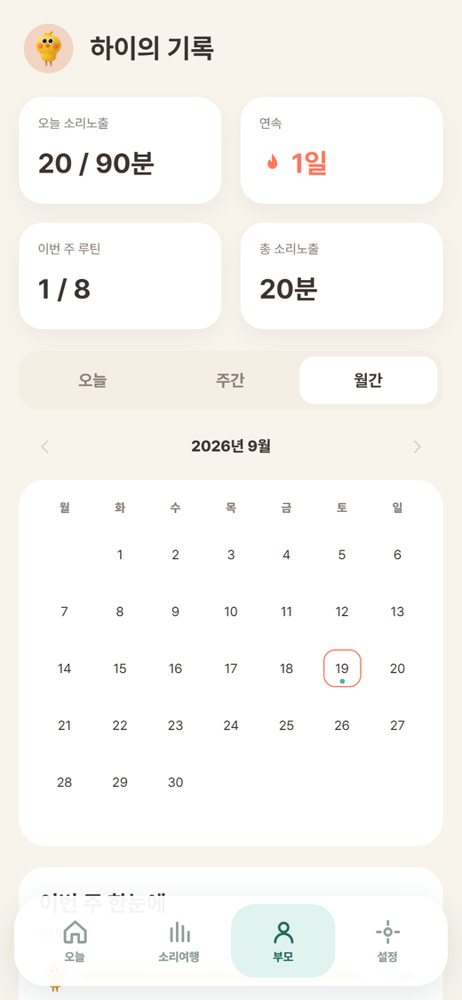
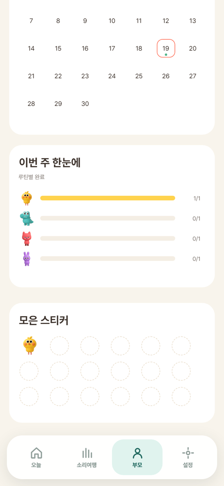

| 구역 | 내용 |
|---|---|
| 머리 | 아바타 동그라미(42)와 “○○의 기록” |
| 요약 네 칸 | 오늘 소리노출 `20 / 90분` · 연속 `1일` · 이번 주 루틴 `1 / 28` · 총 소리노출 `20분` |
| 기간 고르기 | 오늘 · 주간 · 월간 |
| 오늘 | 루틴 네 줄: 색 점, 이름, 분, 상태 |
| 주간 | 루틴(행) × 월~일(열). 색이 찬 동그라미는 완료(부모 표시는 옅게), 빈 동그라미는 안 함. 주말 전용 루틴의 평일 칸만 비운다. 칸을 눌러 표시·해제 |
| 월간 | 달력. 다 한 날은 진한 색, 일부 한 날은 옅은 색 |
| 이번 주 한눈에 | 루틴별 완료 막대 `2 / 5` |
| 모은 스티커 | 6칸씩 3줄에서 시작해 넘치면 한 줄씩 늘어난다. 완료할 때마다 그 루틴의 캐릭터가 붙는다 |

부모 화면의 루틴 색은 시안대로 노랑 `#FFD34D`, 코랄 `#FF765D`, 초록 `#4DB584`, 보라 `#756BE3`입니다.

## C1 설정

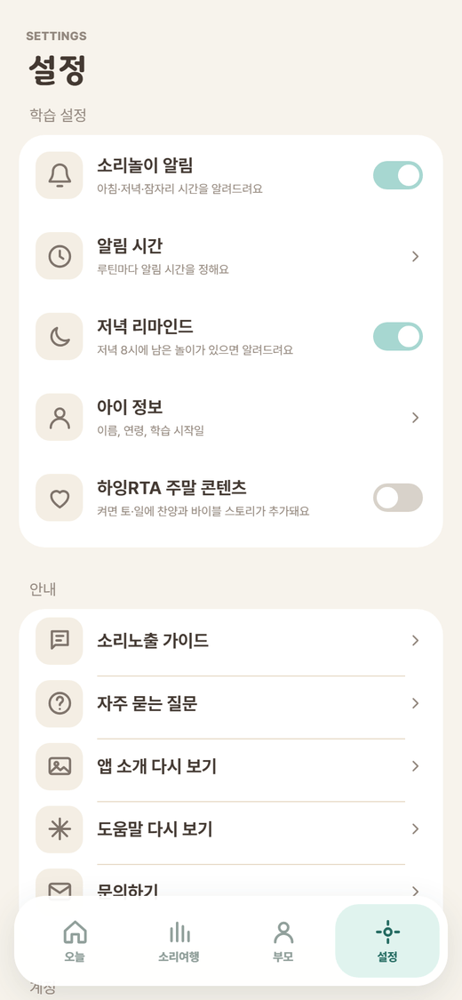

| 묶음 | 항목 |
|---|---|
| 학습 설정 | 소리놀이 알림(스위치), 알림 시간, 저녁 리마인드(스위치), 아이 정보, 하잉RTA 주말 콘텐츠(스위치) |
| 안내 | 소리노출 가이드, 자주 묻는 질문, 시작 영상 다시 보기, 문의하기 |
| 계정 | 이용약관, 개인정보 처리방침, 로그아웃, 탈퇴 |

## 넓은 화면

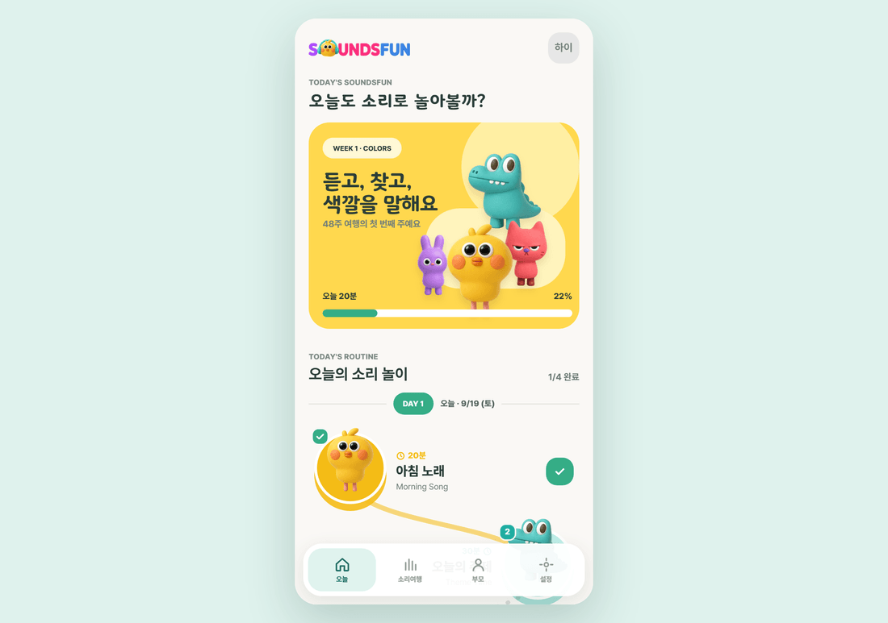

PC나 태블릿에서는 가운데에 폰 크기 틀을 두고 같은 화면을 보여 줍니다. 틀의 높이는 창 높이에서 계산한 숫자 값입니다.

## 창·알림 띠 목록

| ID | 종류 | 언제 | 버튼 |
|---|---|---|---|
| D-01 | 확인 창 | 이미 가입한 이메일 | 로그인하기 / 다른 이메일 |
| D-02 | 확인 창 | ‘들었어요’ 표시 | 표시하기 / 닫기 |
| D-03 | 확인 창 | 표시 지우기 | 지우기 / 닫기 |
| D-04 | 확인 창 | 하잉RTA 켜기 | 추가하기 / 닫기 |
| D-05 | 확인 창 | 로그아웃, 탈퇴 | 확인 / 닫기 |
| T-01 | 알림 띠 | 저장했어요, 표시했어요, 표시를 지웠어요 | – |
| T-02 | 알림 띠 | 앱에서 완료한 기록은 지울 수 없어요 | – |
| H-01 | 도움 카드 | 오늘 탭 첫 방문: 길을 따라 눌러 보라는 한 장 | 알겠어요 |
