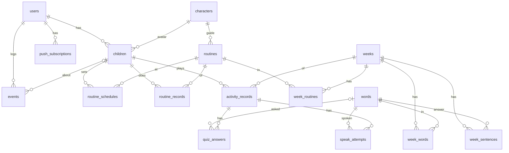
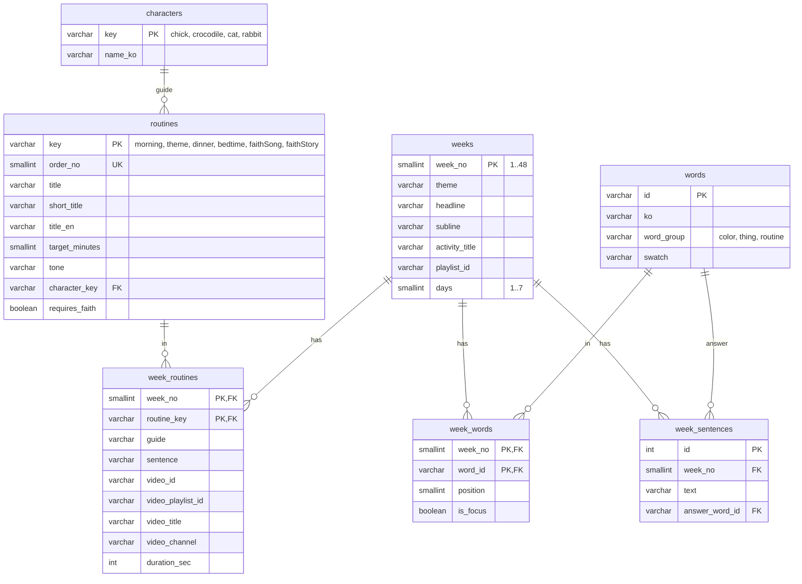
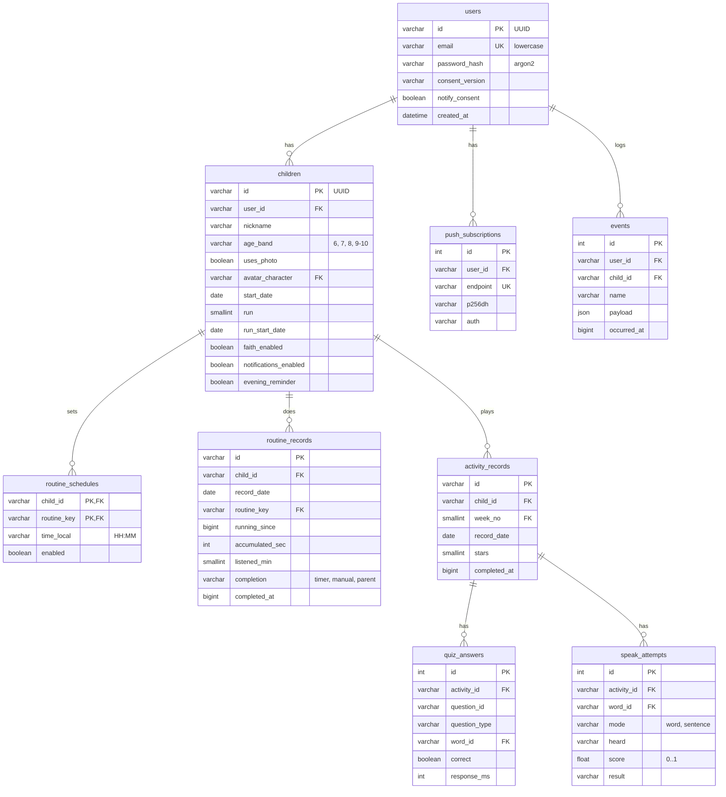

# 데이터베이스 설계서

관계형 DB 16개 테이블입니다. 개발은 SQLite, 운영은 PostgreSQL을 쓰며 모델은 한 벌(`apps/api/app/models.py`, SQLAlchemy 2.0)입니다. 실제 DDL은 `docs/schema/schema.postgresql.sql`, `schema.sqlite.sql`에 뽑아 두었습니다.

## 설계 원칙

1. **3정규형.** 반복되는 값은 참조 테이블로 뺀다. 루틴 이름·분은 `routines`에만, 주차마다 바뀌는 영상은 `week_routines`에만 있다.
2. **무결성은 DB가 지킨다.** API가 검사하더라도 외래키·유니크·체크 제약을 모두 건다. API를 거치지 않은 잘못된 값도 DB가 거부한다(테스트로 확인).
3. **지울 때의 규칙을 정해 둔다.** 사용자 쪽은 CASCADE, 콘텐츠 참조는 RESTRICT.
4. **사진은 저장하지 않는다.** `uses_photo` 여부만 둔다.
5. **멱등 키.** 하루·루틴당 기록은 한 줄(`UNIQUE`). 같은 요청이 여러 번 와도 줄이 늘지 않는다.

## 전체 관계



## 콘텐츠 영역

앱의 콘텐츠 JSON을 서버가 시작할 때 읽어 채웁니다(멱등 시드). 운영자가 영상을 바꾸려면 `week_routines` 한 줄만 고치면 됩니다.



## 사용자·기록 영역



## 테이블 명세

### characters — 캐릭터

| 컬럼 | 형 | 제약 | 설명 |
|---|---|---|---|
| key | VARCHAR(16) | PK | chick · crocodile · cat · rabbit |
| name_ko | VARCHAR(16) | NOT NULL | 병아리 · 악어 · 고양이 · 토끼 |

### routines — 루틴 정의

| 컬럼 | 형 | 제약 | 설명 |
|---|---|---|---|
| key | VARCHAR(16) | PK | morning · theme · dinner · bedtime · faithSong · faithStory |
| order_no | SMALLINT | NOT NULL, UNIQUE, > 0 | 길에서의 번호 |
| title / short_title / title_en | VARCHAR | NOT NULL | 아침 노래 / 아침 / Morning Song |
| target_minutes | SMALLINT | NOT NULL, > 0 | 20 · 30 · 20 · 20 |
| tone | VARCHAR(16) | NOT NULL | 디자인 토큰의 색 이름 |
| character_key | VARCHAR(16) | FK → characters (RESTRICT) | 정거장 캐릭터, 스티커 그림 |
| requires_faith | BOOLEAN | NOT NULL, 기본 false | 하잉RTA를 켠 주말에만 |

### weeks — 주차

| 컬럼 | 형 | 제약 | 설명 |
|---|---|---|---|
| week_no | SMALLINT | PK, 1–48 | 주차 |
| theme | VARCHAR(32) | NOT NULL | Colors |
| headline / subline / activity_title | VARCHAR(64) | NOT NULL | 화면 문구 |
| playlist_id | VARCHAR(64) | NOT NULL | 유튜브 재생목록 |
| days | SMALLINT | NOT NULL, 1–7, 기본 7 | 한 주의 날 수 |

### week_routines — 주차별 루틴 콘텐츠

| 컬럼 | 형 | 제약 | 설명 |
|---|---|---|---|
| week_no | SMALLINT | PK, FK → weeks (CASCADE) | |
| routine_key | VARCHAR(16) | PK, FK → routines (RESTRICT) | |
| guide | VARCHAR(128) | NOT NULL | 안내 한 줄 |
| sentence | VARCHAR(128) | NOT NULL | 오늘의 한 문장 |
| video_id | VARCHAR(16) | NULL | 영상 하나일 때 |
| video_playlist_id | VARCHAR(64) | NULL | 재생목록일 때 |
| video_title / video_channel | VARCHAR | NOT NULL | |
| duration_sec | INTEGER | NULL 또는 > 0 | 영상 길이 |

체크: `video_id`와 `video_playlist_id` 중 하나는 있어야 한다.

### words · week_words · week_sentences — 단어와 문장

| 테이블 | 컬럼 | 제약 |
|---|---|---|
| words | id PK, ko, word_group, swatch | `word_group IN ('color','thing','routine')` |
| week_words | (week_no, word_id) PK, position, is_focus | FK 둘, `UNIQUE(week_no, position)`, position > 0 |
| week_sentences | id PK, week_no FK, text, answer_word_id FK | `UNIQUE(week_no, text)` |

### users — 부모 계정

| 컬럼 | 형 | 제약 | 설명 |
|---|---|---|---|
| id | VARCHAR(36) | PK | UUID |
| email | VARCHAR(255) | NOT NULL, UNIQUE, `email = lower(email)` | 소문자로만 저장 → 대소문자 중복 가입 방지 |
| password_hash | VARCHAR(255) | NOT NULL | argon2 |
| consent_version | VARCHAR(32) | NOT NULL | 동의한 약관 판 |
| notify_consent | BOOLEAN | NOT NULL | 알림 수신 동의 |
| created_at | DATETIME | NOT NULL | |

### children — 아이

| 컬럼 | 형 | 제약 | 설명 |
|---|---|---|---|
| id | VARCHAR(36) | PK | UUID |
| user_id | VARCHAR(36) | FK → users (CASCADE), INDEX | |
| nickname | VARCHAR(16) | NOT NULL, `length(trim(nickname)) > 0` | 공백만은 안 됨 |
| age_band | VARCHAR(8) | `IN ('6','7','8','9-10')` | |
| uses_photo | BOOLEAN | NOT NULL | 사진은 기기에만 |
| avatar_character | VARCHAR(16) | FK → characters (RESTRICT), NULL 가능 | |
| start_date | DATE | NOT NULL | 처음 시작한 날 |
| run | SMALLINT | ≥ 1 | 몇 번째 도는지 |
| run_start_date | DATE | `>= start_date` | 이번 회차 시작일 |
| faith_enabled | BOOLEAN | 기본 false | 하잉RTA 주말 |
| notifications_enabled / evening_reminder | BOOLEAN | 기본 true | |

체크: `uses_photo OR avatar_character IS NOT NULL` — 아바타가 없는 아이는 없다.

### routine_schedules — 알림 시각

| 컬럼 | 형 | 제약 |
|---|---|---|
| child_id | VARCHAR(36) | PK, FK → children (CASCADE) |
| routine_key | VARCHAR(16) | PK, FK → routines (RESTRICT) |
| time_local | VARCHAR(5) | HH:MM 24시간 형식 체크, INDEX |
| enabled | BOOLEAN | 기본 true |

시간 형식 체크는 DB마다 문법이 달라 방언별로 선언했습니다. PostgreSQL은 정규식 `~ '^([01][0-9]|2[0-3]):[0-5][0-9]$'`, SQLite는 `GLOB`.

### routine_records — 루틴 기록

| 컬럼 | 형 | 제약 | 설명 |
|---|---|---|---|
| id | VARCHAR(36) | PK | |
| child_id | VARCHAR(36) | FK → children (CASCADE) | |
| record_date | DATE | NOT NULL | 기기의 그날 |
| routine_key | VARCHAR(16) | FK → routines (RESTRICT) | |
| running_since | BIGINT | NULL | 흐르는 중이면 시작 시각(ms) |
| accumulated_sec | INTEGER | ≥ 0 | 멈추기 전까지 쌓인 초 |
| listened_min | SMALLINT | ≥ 0 | 인정된 분 |
| completion | VARCHAR(8) | NULL 또는 `IN ('timer','manual','parent')` | 어떻게 완료했나 |
| completed_at | BIGINT | NULL | 완료 시각(ms) |
| updated_at | DATETIME | NOT NULL | |

| 제약 | 뜻 |
|---|---|
| `UNIQUE(child_id, record_date, routine_key)` | 하루·루틴당 한 줄 |
| `(completion IS NULL) = (completed_at IS NULL)` | 완료 방식과 시각은 함께 있거나 함께 없다 |
| `completed_at IS NULL OR running_since IS NULL` | 끝난 기록은 시간이 흐르지 않는다 |
| `INDEX(child_id, record_date)` | 주간·월간 조회 |

### activity_records · quiz_answers · speak_attempts — 소리활동

| 테이블 | 핵심 제약 |
|---|---|
| activity_records | `UNIQUE(child_id, week_no, record_date)`, stars ≥ 0, FK child(CASCADE)·week(RESTRICT) |
| quiz_answers | `UNIQUE(activity_id, question_id)`, `question_type IN (pickImage, pickWord, match, sentenceColor)`, response_ms ≥ 0, **`(question_type = 'match') = (word_id IS NULL)`** — 짝 맞추기만 단어가 없다 |
| speak_attempts | `UNIQUE(activity_id, word_id, mode)` — 말하기 게임은 같은 단어를 단어로 한 번, 문장으로 한 번 말한다. `mode IN (word, sentence)`, `score BETWEEN 0 AND 1`, `result IN (pass, passAfterRetry, passByParent, given, skipped)` |

### push_subscriptions · events

| 테이블 | 핵심 제약 |
|---|---|
| push_subscriptions | `endpoint` UNIQUE, FK user (CASCADE) |
| events | FK user (CASCADE), FK child (**SET NULL**) — 아이를 지워도 익명 통계는 남는다 |

## 지울 때의 규칙

| 지우는 것 | 함께 지워지는 것 | 막히는 경우 |
|---|---|---|
| users 한 줄 | children → schedules, records, activities → answers, attempts / push_subscriptions / events | – |
| children 한 줄 | 위의 아이 아래 전부. events.child_id는 NULL로 | – |
| weeks 한 줄 | week_routines, week_words, week_sentences | 그 주차의 activity_records가 있으면 RESTRICT |
| routines · characters · words | – | 참조하는 줄이 있으면 RESTRICT |

## 무결성 검증

`apps/api/tests/test_api.py`에서 API를 거치지 않고 DB에 직접 넣어 거부되는지 확인합니다.

| 시도 | 막는 제약 |
|---|---|
| 완료 방식만 있고 완료 시각이 없는 기록 | ck_routine_records_completion_pair |
| 없는 완료 방식 `later` | ck_routine_records_completion |
| 음수 초 | ck_routine_records_non_negative |
| 없는 루틴 `nap`, 없는 아이, 없는 부모 | 외래키 |
| 같은 날·같은 루틴 두 줄 | uq_routine_records_day_routine |
| 공백뿐인 이름, 연령 `12` | ck_children_nickname_not_blank, ck_children_age_band |

SQLite는 연결마다 `PRAGMA foreign_keys=ON`을 켜서 외래키를 지키게 했습니다.

## 자주 쓰는 질의

```sql
-- 주간 완료율 (지원서 지표: 주간 완료율 65%)
SELECT c.id,
       COUNT(r.completed_at) * 1.0 / (7 * 4) AS weekly_rate
FROM children c
LEFT JOIN routine_records r
       ON r.child_id = c.id
      AND r.record_date BETWEEN :monday AND :sunday
GROUP BY c.id;

-- 지금 알림을 보낼 대상 (매분 실행)
SELECT s.child_id, s.routine_key
FROM routine_schedules s
JOIN children c ON c.id = s.child_id AND c.notifications_enabled
LEFT JOIN routine_records r
       ON r.child_id = s.child_id AND r.routine_key = s.routine_key AND r.record_date = :today
WHERE s.time_local = :hhmm AND s.enabled AND r.completed_at IS NULL;

-- 아이들이 어려워하는 단어
SELECT word_id, AVG(score) AS avg_score, COUNT(*) AS tries
FROM speak_attempts GROUP BY word_id ORDER BY avg_score;
```
