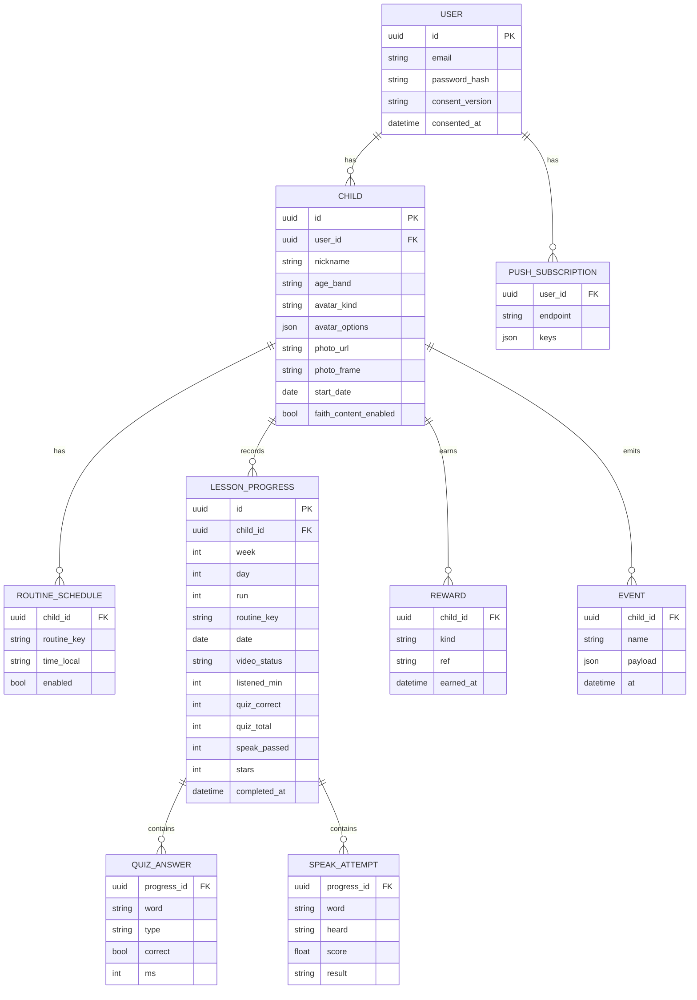

# 데이터·API 명세서

MVP는 **기기 저장(local-first)** 으로 동작하고, 서버는 같은 모양의 API로 동기화한다. 앱 코드는 `ProgressRepository` 인터페이스만 보며, 로컬 구현과 서버 구현을 바꿔 끼운다.

## ERD



## 값 정의

| 필드 | 값 |
|---|---|
| `age_band` | `6` `7` `8` `9-10` |
| `avatar_kind` | `builder` (부위 옵션) · `photo` |
| `routine_key` | `morning` `theme` `dinner` `bedtime` · 주말 선택: `faith_song` `faith_story` |
| `video_status` | `none` · `auto` (타이머 완료) · `manual` (부모 확인) |
| `speak result` | `pass` · `pass_after_retry` · `pass_by_parent` · `skipped` · `given` (2회 미달 통과) |
| `reward kind` | `sticker` · `day_badge` · `week_trophy` |
| `run` | 같은 Week 반복 회차. 1부터 |

## 상태 계산 (순수 함수, `entities/`)

| 함수 | 입력 | 출력 |
|---|---|---|
| `dayIndexOf(startDate, today)` | 시작일, 오늘 | 1~7 또는 범위 밖 |
| `nodeState(progress, dayIndex, todayIndex)` | 진행, Day, 오늘 | `locked` `open` `inProgress` `done` `missed` |
| `todayMinutes(progressList)` | 오늘 진행 | 합계 분 |
| `streak(progressByDate, today)` | 날짜별 완료 여부 | 연속 일수 (오늘 미완료면 어제까지) |
| `buildQuiz(words, ageBand, seed)` | 단어, 연령, 시드 | 문항 8개 |
| `judgeSpeech(target, heard)` | 목표, 인식 결과 | 0~1 점수, 통과 여부(≥0.7) |

## 콘텐츠 JSON

파일: `content/weeks/week1.json`. 컴포넌트는 이 구조만 안다.

```json
{
  "id": "y1-w01", "week": 1, "theme": "Colors", "themeKo": "색깔",
  "routines": [
    {
      "key": "morning", "kind": "listen", "targetMinutes": 20, "order": 1,
      "video": { "provider": "youtube", "id": "CCClRXsYiik",
                 "title": "Good Morning Mr. Rooster + More", "channel": "Super Simple Songs", "durationSec": 3944 },
      "parentTip": "등원 준비하면서 틀어주세요. 화면을 안 봐도 괜찮아요.",
      "phrases": ["Good morning.", "Let's get dressed.", "Put on your shoes."],
      "sticker": "sticker-sun"
    },
    {
      "key": "theme", "kind": "play", "targetMinutes": 30, "order": 2,
      "video": { "provider": "youtube", "id": "v-BvRlsbUiU",
                 "title": "Red Yellow Green Blue + More", "channel": "Super Simple Songs", "durationSec": 3120 },
      "parentTip": "함께 보고, 끝나면 놀이를 해요.",
      "words": ["red", "yellow", "green", "blue", "apple", "sun", "clover", "sky"],
      "sentences": [
        { "text": "It's red.",    "answer": "red" },
        { "text": "It's blue.",   "answer": "blue" },
        { "text": "It's yellow.", "answer": "yellow" },
        { "text": "It's green.",  "answer": "green" }
      ],
      "quiz": { "count": 8, "mix": { "pickImage": 3, "pickWord": 2, "match": 1, "sentenceColor": 2 } },
      "speak": { "words": ["red", "yellow", "green", "blue"] },
      "sticker": "sticker-palette"
    }
  ],
  "weekend": {
    "faith_song":  { "kind": "listen", "targetMinutes": 20, "playlist": "PLpw2Kv-fs8gAlxnJNsnflxx0wSzJIFG1a", "sticker": "sticker-note" },
    "faith_story": { "kind": "listen", "targetMinutes": 20, "playlist": "PLpw2Kv-fs8gBfxMi6pToFPD9HuwyaDT_i", "sticker": "sticker-book" }
  }
}
```

단어 사전: `content/words.json`

```json
{
  "red":   { "ko": "빨강", "image": "words/red.png",   "audio": "words/red.mp3",   "color": "#E53935", "group": "color" },
  "apple": { "ko": "사과", "image": "words/apple.png", "audio": "words/apple.mp3", "group": "thing" }
}
```

## API (FastAPI)

기본 경로 `/api/v1`. 인증은 `Authorization: Bearer <access>`.

| 메서드 | 경로 | 설명 | 요청 → 응답 |
|---|---|---|---|
| POST | `/auth/signup` | 가입 | email, password, consents → tokens |
| POST | `/auth/login` | 로그인 | email, password → tokens |
| POST | `/auth/refresh` | 토큰 갱신 | refresh → tokens |
| POST | `/auth/password-reset` | 재설정 메일 | email → 204 |
| DELETE | `/me` | 탈퇴 (즉시 삭제) | → 204 |
| GET | `/children` | 아이 목록 | → Child[] |
| POST | `/children` | 아이 생성 | nickname, ageBand, avatar… → Child |
| PATCH | `/children/{id}` | 수정 | 부분 → Child |
| PUT | `/children/{id}/photo` | 사진 업로드 (multipart, 256px) | → photoUrl |
| PUT | `/children/{id}/schedule` | 루틴 시각 4개 | RoutineSchedule[] → 204 |
| GET | `/content/weeks/{week}` | 콘텐츠 JSON | → Week |
| GET | `/children/{id}/progress?from&to` | 진행 조회 | → LessonProgress[] |
| PUT | `/children/{id}/progress/{lessonKey}` | 진행 저장 (멱등, 클라이언트 id) | LessonProgress → 200 |
| POST | `/children/{id}/manual-check` | 수동 체크·해제 | date, routineKey, checked → 200 |
| GET | `/children/{id}/summary?week` | 대시보드 요약 | → Summary |
| POST | `/push/subscriptions` | 웹 푸시 구독 | subscription → 201 |
| DELETE | `/push/subscriptions` | 구독 해제 | endpoint → 204 |
| POST | `/push/test` | 테스트 알림 | → 202 |
| POST | `/events` | 이벤트 배치 | Event[] → 202 |

`lessonKey` = `{week}-{run}-{day}-{routineKey}` 예: `1-1-3-theme`

## 동기화

- 진행은 기기에 먼저 쓰고 큐에 넣는다. 온라인이면 `PUT progress` 로 올린다 (멱등)
- 충돌: 서버는 `completed_at` 이 더 이른 쪽을 유지. 수동 체크는 마지막 요청 우선
- 콘텐츠 JSON은 앱에 번들, 서버 버전이 높으면 교체

## 이벤트

| 이름 | 페이로드 | 시점 |
|---|---|---|
| `lesson_open` | lessonKey, from(`node` `now_card` `notification`) | L0 열림 |
| `video_open` | lessonKey | 유튜브 열기 |
| `video_done` | lessonKey, status(auto/manual), minutes | ✓ 또는 수동 |
| `quiz_answer` | lessonKey, word, type, correct, ms | 문항마다 |
| `speak_result` | lessonKey, word, result, score | 단어마다 |
| `lesson_done` | lessonKey, stars, durationSec | L4 |
| `day_done` | date | 4개 완료 |
| `manual_check` | date, routineKey, checked | 대시보드 |
| `notification_open` | kind, routineKey | 알림 탭 |
| `guide_seen` | guideId | 가이드 닫힘 |

## 파일럿 지표 산출

| 지표 | 계산 |
|---|---|
| 루틴 완료율 | `lesson_done` 수 / (활성 아이 수 × 4 × 일수) |
| 하루 90분 달성률 | `day_done` 일수 / 활성 일수 |
| 4주 잔존율 | 28일째 주에 1회 이상 `lesson_done` 한 아이 / 시작 아이 |
| 단어 정답률 | `quiz_answer.correct` 평균, 단어별 |
| 말하기 시도율 | result ≠ skipped 비율 |
| 수동 비율 | video_status manual / 전체 |
