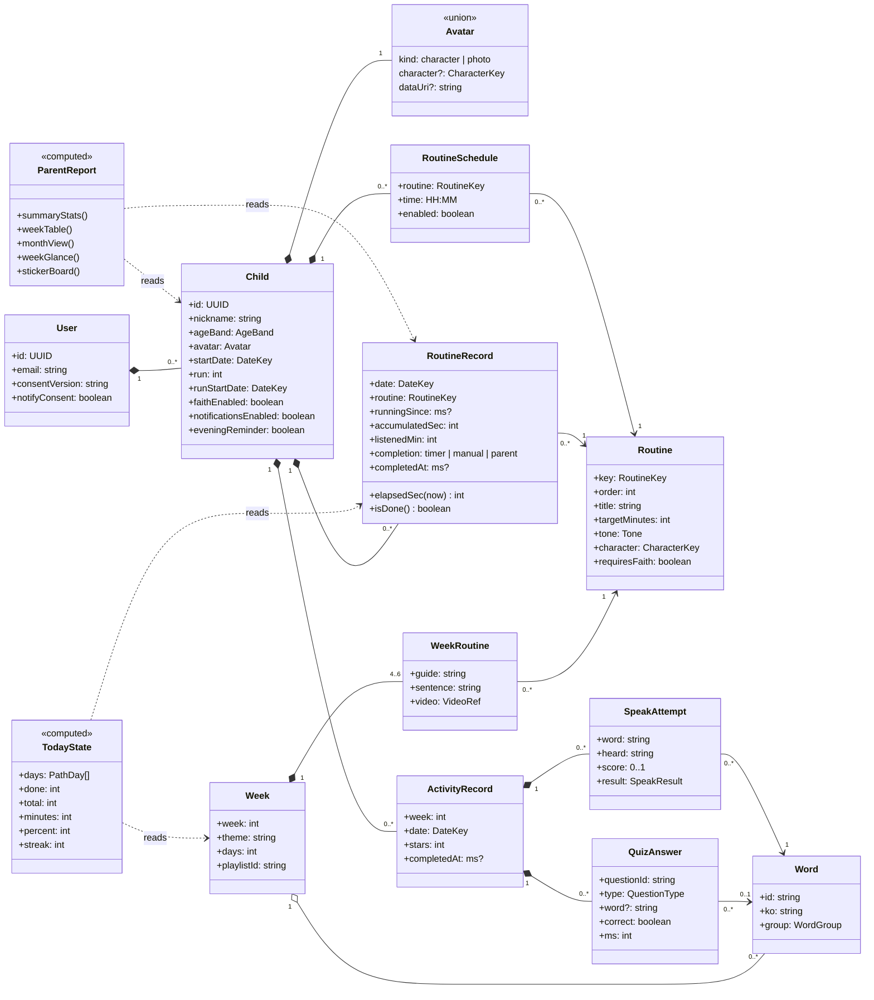
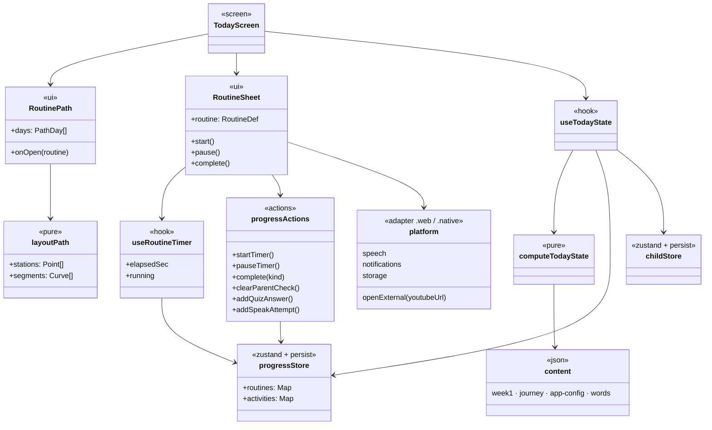
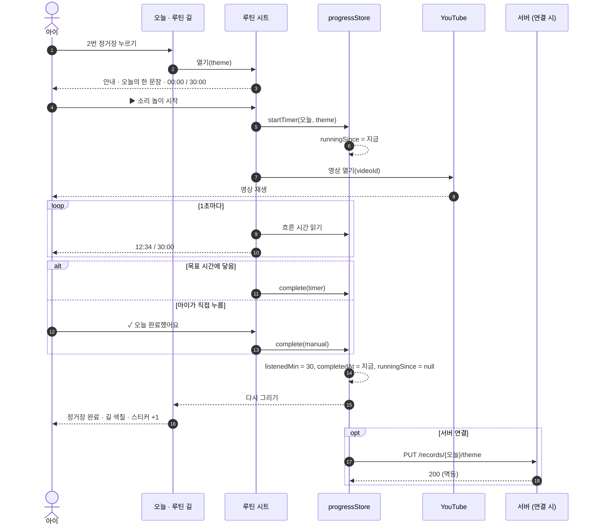
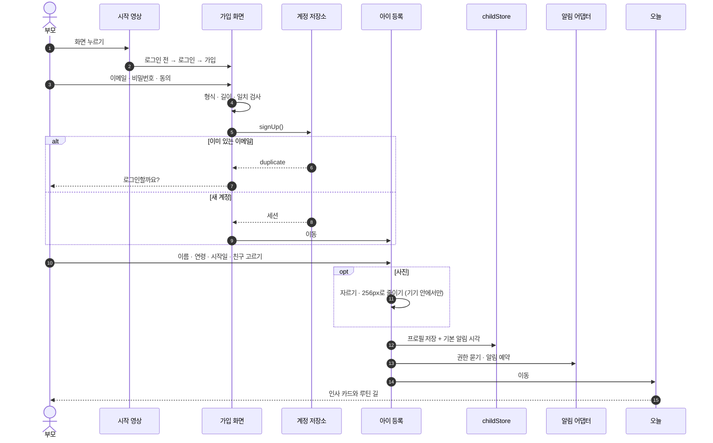
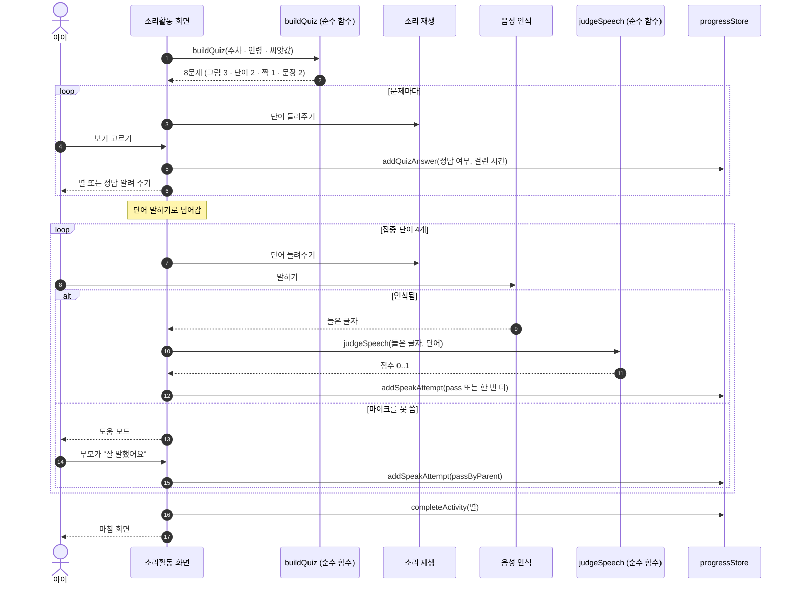
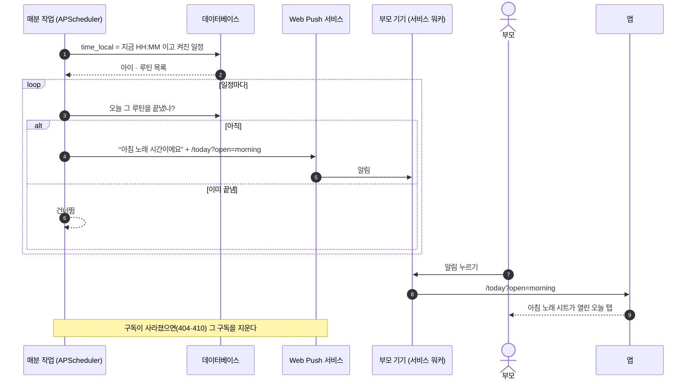
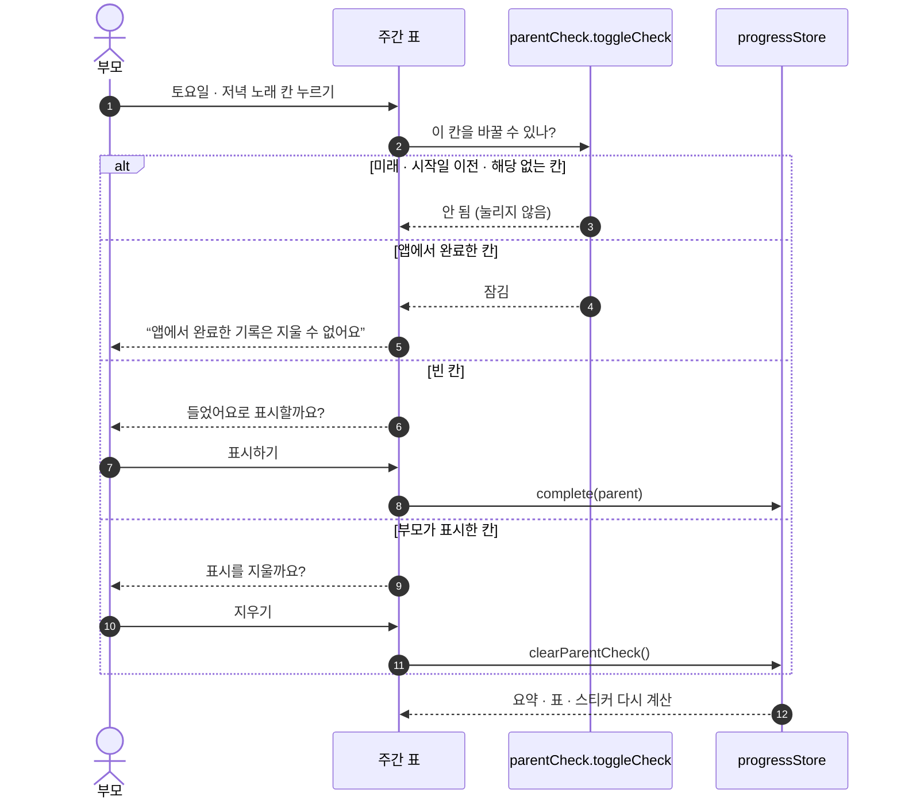
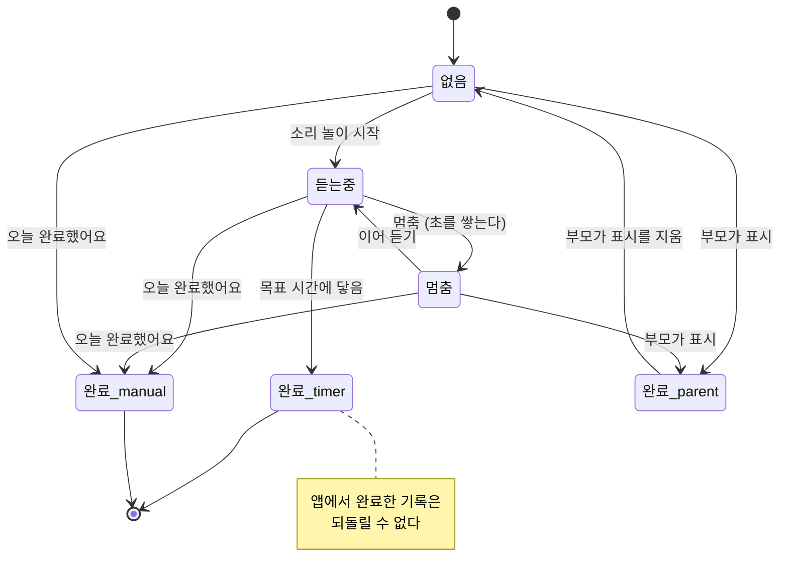
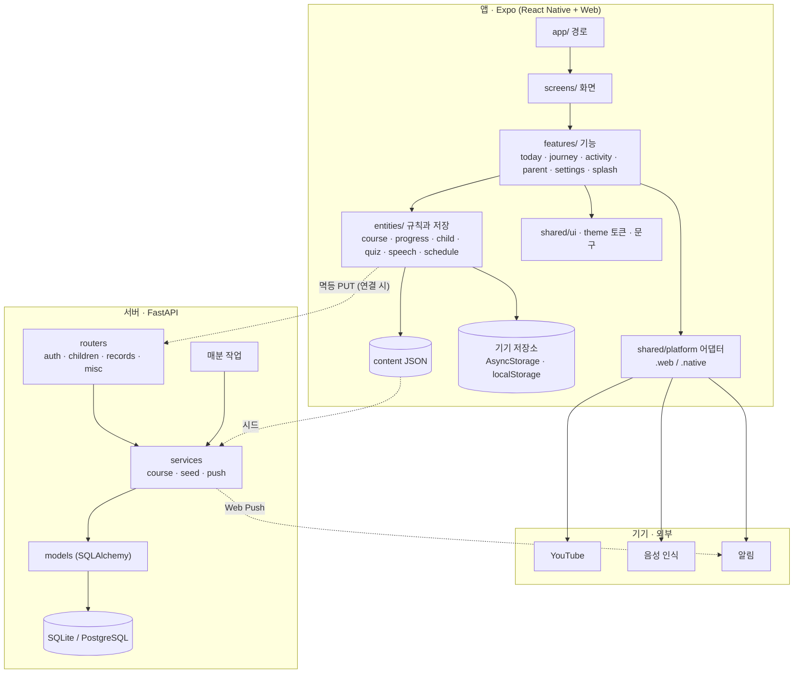
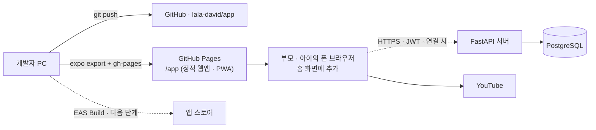

# 설계 모델 (UML)

유즈케이스 다이어그램은 03 문서에, ERD는 05 문서에 있습니다. 여기에는 클래스·시퀀스·상태·컴포넌트·배치 다이어그램을 모았습니다.

## 1. 클래스 다이어그램 — 도메인 모델

앱(`entities/`)과 서버(`models.py`)가 함께 쓰는 개념입니다. 계산은 모두 순수 함수로 두어 화면 없이 테스트합니다.

## 2. 클래스 다이어그램 — 앱의 층

## 3. 시퀀스 — 루틴 듣고 완료하기 (UC-03, UC-04)

## 4. 시퀀스 — 가입에서 첫 화면까지 (UC-01, UC-11, UC-12)

## 5. 시퀀스 — 소리활동 (UC-05, UC-06)

## 6. 시퀀스 — 알림 (UC-15)

이 그림은 서버를 연결했을 때의 Web Push 흐름입니다. 이번 버전은 서버 없이, 앱은 기기 알림을 미리 예약하고(`buildUpcoming`) 웹은 열려 있는 동안 서비스 워커로 알림을 띄웁니다.

## 7. 시퀀스 — ‘들었어요’ 표시 (UC-09)

## 8. 상태 — 루틴 기록

DB의 체크 제약이 이 상태를 그대로 지킵니다: 완료 방식과 완료 시각은 함께 있고, 완료된 줄은 `running_since`가 비어 있습니다.

## 9. 컴포넌트

## 10. 배치

