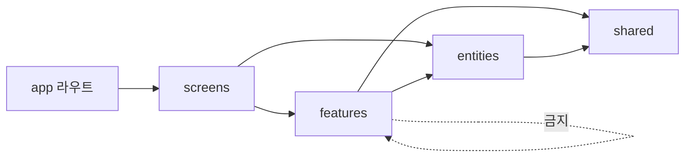
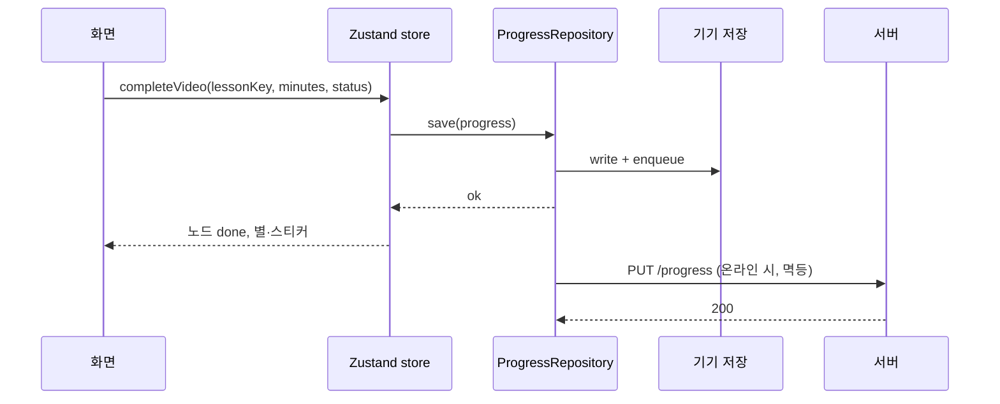

# 아키텍처·코드 규칙

## 스택

| 영역 | 선택 | 이유 |
|---|---|---|
| 앱·웹 | Expo (React Native + react-native-web), TypeScript | 코드 한 벌로 iOS·Android·웹 |
| 라우팅 | expo-router | 파일 기반, 딥링크(알림 → 레슨) |
| 상태 | Zustand (클라이언트) · TanStack Query (서버) | 작고 예측 가능 |
| 저장 | AsyncStorage / localStorage → `StorageAdapter` | local-first |
| 아바타 | DiceBear (`@dicebear/core` + collection, MIT) → SVG | 부위별 옵션, 그림 저장 불필요 |
| 아바타 렌더 | react-native-svg (앱) · inline SVG (웹) | — |
| 사진 | expo-image-picker + expo-image-manipulator | 원형 자르기·축소 |
| 음성인식 | 웹: Web Speech API · 앱: expo-speech-recognition · 폴백: 서버 faster-whisper | 무료, 설치 없음 |
| 음성 출력 | 미리 생성한 mp3 (expo-av) · 없으면 expo-speech | 일관된 발음 |
| 알림 | 앱: expo-notifications 로컬 예약 · 웹: 서비스워커 + Web Push | 앱은 서버 없이 동작 |
| 백엔드 | FastAPI, SQLAlchemy, PostgreSQL(개발 SQLite), pywebpush, APScheduler | 팀이 Python 가능 |
| 배포 | 웹: GitHub Pages (정적) · 앱: EAS Build · API: 추후 | MVP는 정적으로 먼저 |
| 그림 | Recraft AI 초안 → 디자이너 교체 | 파일명·규격 고정 |

## 플랫폼 어댑터

기능 코드는 인터페이스만 본다. 플랫폼별 구현은 파일 확장자(`.web.ts` / `.native.ts`)로 갈린다.

| 인터페이스 | 메서드 | web | native |
|---|---|---|---|
| `SpeechRecognizer` | `isAvailable()` `listen(lang): Promise<string>` `stop()` | Web Speech API | expo-speech-recognition |
| `NotificationScheduler` | `requestPermission()` `scheduleDaily(id, time, payload)` `cancel(id)` `sendTest()` | Push 구독 → 서버 | expo-notifications |
| `ExternalLinks` | `openYouTube(videoId)` `openPlaylist(id)` | `window.open` | `Linking` (youtube:// → https) |
| `AudioPlayer` | `play(asset)` `stop()` | HTMLAudio | expo-av |
| `StorageAdapter` | `get` `set` `remove` | localStorage | AsyncStorage |
| `PhotoPicker` | `pick()` `crop(uri, circle)` | input file + canvas | expo-image-picker |

## 폴더 구조 (구현 기준)

```
apps/mobile/
├─ app.config.ts               앱 설정 (baseUrl은 환경 변수)
├─ public/                     웹: sw.js · manifest.json · icons/
├─ assets/
│  ├─ images/                  words · mascot · stickers · routines · onboarding · guides · celebrate · frames (WebP)
│  └─ audio/                   words · sentences · mascot · prompts (mp3) · sfx (wav)
└─ src/
   ├─ app/                     라우트 파일만 (한 줄 export)
   │  ├─ _layout.tsx           폰트·저장소 복원·로그인/온보딩 보호(Stack.Protected)·전역 호스트
   │  ├─ index.tsx             첫 화면 리다이렉트
   │  ├─ (auth)/               welcome · login · signup
   │  ├─ onboarding/           child · avatar · photo · schedule · notifications
   │  ├─ (tabs)/               home · parent · settings  (+ 커스텀 탭 바)
   │  ├─ lesson/               video · quiz · speak · done · trophy   (?key=r1-d1-theme)
   │  └─ manage/               child · avatar · photo · notifications · help · intro
   ├─ app-shell/               앱 전체 조립: 탭 설정·탭 바·저장소 복원 대기·PWA head
   ├─ screens/                 화면 = 기능 조합 (라우트에서 불러 씀)
   ├─ features/                사용자 동작 단위 (model/ + ui/)
   │   auth · avatar · child-profile · course-map · guides · lesson · notifications
   │   parent-dashboard · parent-gate · rewards · schedule
   ├─ entities/                도메인: 타입 · 순수 로직(lib) · 저장소(model)
   │   account · child · content · course · guide · progress · quiz · schedule · session · speech
   ├─ shared/
   │   ui/                     AppText · BigButton · HoldButton · Sheet · FeedbackHost · ProgressRing · icons …
   │   theme/tokens.ts         색·루틴 톤·간격·반경·글꼴·크기·그림자·모션
   │   platform/               speech · notifications (index.ts / index.web.ts / index.native.ts) · sound · photo · links · haptics · crypto
   │   feedback/               팝업·토스트 스토어 (confirmDialog, toast)
   │   analytics/              이벤트 로그
   │   i18n/strings.ko.ts      모든 화면 문구
   │   lib/                    format · clock · storage · id
   └─ content/                 weeks/week1.json · words.json · guides.json · help.json · legal.json · avatar.json · app-config.json
                               generated/assets.ts (그림·소리 require 등록, 자동 생성)
```

## 의존 규칙



- `app/` 은 한 줄 export 또는 최소 조립. 로직 없음
- `screens/` 가 여러 feature를 조합한다. feature 끼리는 서로 모르게 둔다 (예외: 전역 호스트인 parent-gate·guides는 어디서나 호출)
- `entities/*/lib` 는 React·저장소를 모르는 순수 TypeScript → Vitest 단위 테스트 대상
- `entities/*/model` 은 zustand persist 저장소. 화면은 `progressActions` 같은 동작 함수로만 기록을 바꾼다
- 문구는 `strings.ko.ts`, 색·크기는 `tokens.ts`, 콘텐츠는 JSON. 컴포넌트 안에 리터럴 금지
- 한 파일 150줄, 함수 30줄, props 5개를 넘으면 나눈다
- 이름: 컴포넌트 `PascalCase`, 훅 `useXxx`, 순수 함수 동사형 `computeStreak`, 상수 `UPPER_SNAKE`

## 상태 흐름



## 품질

| 항목 | 도구 |
|---|---|
| 린트·포맷 | ESLint (expo config) + Prettier, 커밋 훅 |
| 타입 | TypeScript strict |
| 단위 테스트 | Vitest — `entities/*` (상태 계산, 연속일수, 문항 생성, 발화 판정) |
| 컴포넌트 | React Native Testing Library — 핵심 화면 |
| E2E | Maestro (앱) · Playwright (웹) — UC-02, UC-03, UC-08 |

## 환경 변수

| 이름 | 용도 |
|---|---|
| `EXPO_PUBLIC_API_URL` | 서버 주소. 비우면 local-only |
| `EXPO_PUBLIC_VAPID_PUBLIC_KEY` | 웹 푸시 |
| `RECRAFT_API_KEY` | content-tools 전용. 앱에 넣지 않음 |
| `DATABASE_URL` `JWT_SECRET` `VAPID_PRIVATE_KEY` | API |
