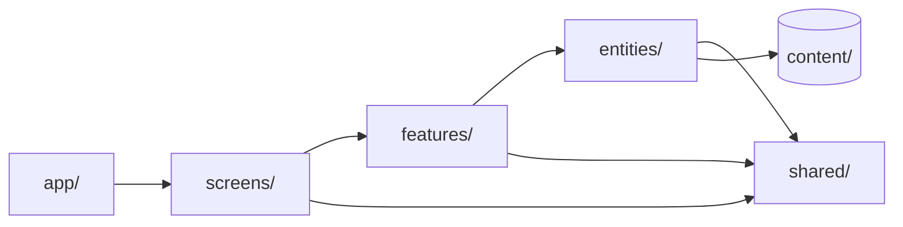
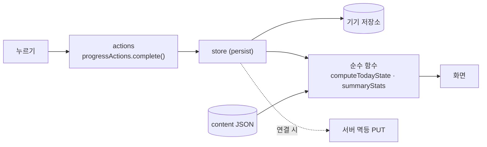

# 아키텍처·코드 규칙

## 스택

| 영역 | 선택 | 이유 |
|---|---|---|
| 앱 | Expo SDK 57 (React Native 0.86, react-native-web) | 코드 한 벌로 모바일 웹·PWA와 앱 |
| 언어 | TypeScript strict | 오류 0을 유지 |
| 경로 | expo-router (typed routes, `Stack.Protected`) | 로그인·아이 등록 여부로 화면 보호 |
| 상태 | Zustand + persist | 작고 단순. 기기 저장과 바로 연결 |
| 움직임·그림 | react-native-reanimated, react-native-svg, expo-linear-gradient | 길의 곡선, 캐릭터 둥실, 카드 그러데이션 |
| 영상 | expo-video, react-native-webview | 시작 영상은 expo-video. 루틴 영상은 유튜브 IFrame 플레이어(`shared/platform/youtube`): 앱은 WebView, 웹은 iframe |
| 소리·말 | expo-audio, expo-speech, expo-speech-recognition / Web Speech API | 단어 소리, 음성 인식 |
| 알림 | expo-notifications / Notification + 서비스 워커 | 앱은 기기 예약, 웹은 서비스 워커 알림(서버 연결 시 Web Push) |
| 서버 | FastAPI, SQLAlchemy 2.0, argon2, PyJWT, pywebpush, APScheduler | 05·06 문서 |
| DB | SQLite(개발) · PostgreSQL(운영) | 같은 모델 |
| 테스트 | Vitest, Playwright, pytest | 10 문서 |

## 폴더

```
sol/
├─ apps/
│  ├─ mobile/                앱 (Expo)
│  │  ├─ assets/             글꼴 · 그림(WebP) · 시작 영상 · 단어 소리
│  │  └─ src/
│  │     ├─ app/             경로 파일만. 화면을 불러 돌려준다
│  │     ├─ app-shell/       탭 막대, 저장소 준비, PWA 머리말
│  │     ├─ screens/         화면 조립
│  │     ├─ features/        today · journey · activity · parent · settings · splash · help · child-profile · notifications · auth
│  │     ├─ entities/        content · course · child · progress · quiz · speech · schedule · session · account
│  │     ├─ shared/          ui · theme(tokens) · i18n(문구) · platform(어댑터) · lib
│  │     └─ content/         week1.json · journey.json · app-config.json · words.json · help.json · legal.json
│  └─ api/                   서버 (FastAPI)
│     ├─ app/ core · models · schemas · routers · services
│     ├─ scripts/export_schema.py
│     └─ tests/
├─ packages/content-tools/   그림 변환, 자산 목록 생성, 유즈케이스 다이어그램 생성
└─ docs/                     src(md) → html · docx, assets, schema(sql)
```

## 의존 규칙



| 규칙 | 내용 |
|---|---|
| 한 방향 | 위에서 아래로만 가져온다. `entities`는 `features`를 모른다 |
| 기능끼리 | `features/a`는 `features/b`를 가져오지 않는다. 함께 쓸 것은 `entities`나 `shared`로 내린다 |
| 계산은 순수 함수 | 날짜·진행·리포트·문제 만들기·발음 판정·길 좌표는 화면과 저장소를 모른다 → 단위 테스트 |
| 저장소는 얇게 | store는 값과 저장만. 규칙은 `lib/`의 함수 |
| 플랫폼 차이 | `shared/platform/*.web.ts` / `*.native.ts` 어댑터 안에만. 화면은 차이를 모른다 |

## 하드코딩 금지

| 종류 | 있는 곳 |
|---|---|
| 색·간격·모서리·글자 크기·그림자 | `shared/theme/tokens.ts` |
| 화면 문구 | `shared/i18n/strings.ko.ts` |
| 루틴·영상·단어·문제 구성 | `content/weeks/week1.json` |
| 목표 분, 기본 알림 시각, 연령, 캐릭터, 스티커 칸 수, 발음 기준 | `content/app-config.json` |
| 그림·소리 파일 목록 | `content/generated/assets.ts` (도구가 만든다) |
| 주소·키 | `.env` (저장소에 올리지 않는다) |

2주차를 더하려면 `week2.json`과 그림·소리를 넣고 `entities/content/content.ts`의 `WEEKS`에 한 줄 등록하면 됩니다. 화면 코드는 고치지 않습니다.

## 상태 흐름



기록의 키는 `날짜:루틴`입니다. 시간은 “시작 시각 + 쌓인 초”로 저장하므로 앱을 닫아도 이어집니다.

## 반응형

| 폭 | 동작 |
|---|---|
| ~430 | 화면 가득. 길의 좌표는 폭에 맞춰 다시 계산 |
| 431~ | 가운데 폰 틀(최대 430), 둥근 모서리와 그림자, 옅은 민트 배경 |

틀의 높이는 백분율이 아니라 창 높이에서 계산한 숫자입니다(react-native-web에서 백분율 높이가 0이 되는 문제를 피함). 좁을 때와 넓을 때의 컴포넌트 구조는 같습니다.

## 코드 규칙

- 주석은 “왜”가 필요할 때만 한 줄. 무엇을 하는지는 이름이 말한다.
- 컴포넌트는 한 가지 일. 길어지면 `ui/`의 조각으로 나눈다.
- `any` 금지, 단언(`as`)은 경계에서만.
- 파일 이름: 컴포넌트 `PascalCase.tsx`, 그 밖 `camelCase.ts`, 테스트 `*.test.ts`.
- 서버: 라우터는 얇게(검사·권한·응답), 규칙은 `services/`, 제약은 `models.py`.

## 빌드와 배포

```bash
# 앱 개발
cd apps/mobile && npx expo start --web

# 검사
npx tsc --noEmit && npx vitest run

# 웹 배포 (GitHub Pages, /app 아래)
EXPO_PUBLIC_BASE_URL=app npx expo export -p web
node scripts/spa-fallback.mjs          # 404.html, .nojekyll
npx gh-pages --nojekyll -d dist

# 문서
python docs/build.py                   # md → html + docx, 다이어그램 PNG
node packages/content-tools/src/usecase-diagram.mjs
```

| 환경 변수 | 설명 |
|---|---|
| EXPO_PUBLIC_BASE_URL | 웹 배포 경로 (`app`) |
| EXPO_PUBLIC_LISTEN_TIME_SCALE | 시연·테스트에서 시간을 빨리 흐르게 (`npm run web:demo`은 60배) |

> 이번 버전의 앱은 서버에 연결하지 않고 기기 저장만 씁니다. 서버는 따로 완성·테스트되어 있고, 연결은 계정 저장소(`entities/account`)의 구현을 API용으로 바꾸고 기록 저장 뒤에 멱등 PUT을 보내는 작업으로 끝납니다.

## 보안·개인정보

- 아이에 대해 받는 것: 이름, 연령대, 시작일, 고른 캐릭터. 사진은 기기에만.
- 비밀번호는 기기에서는 소금 + 해시, 서버에서는 argon2.
- 광고·외부 분석 도구 없음. 사용 로그는 자체 `events` 테이블에만.
- 원본 지원서·가이드북·디자인 원본은 저장소에 올리지 않는다(`.gitignore`).
