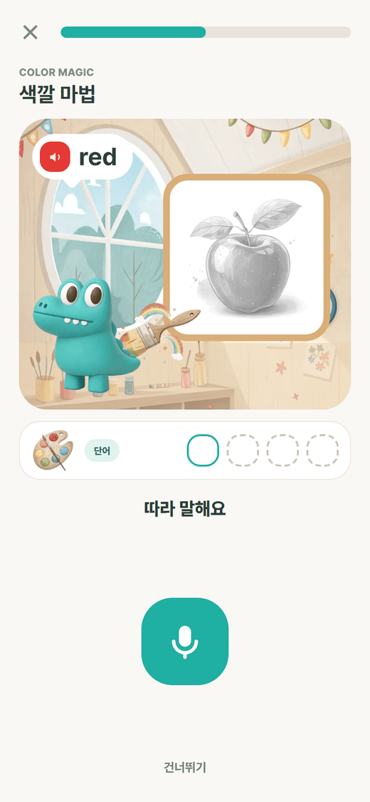
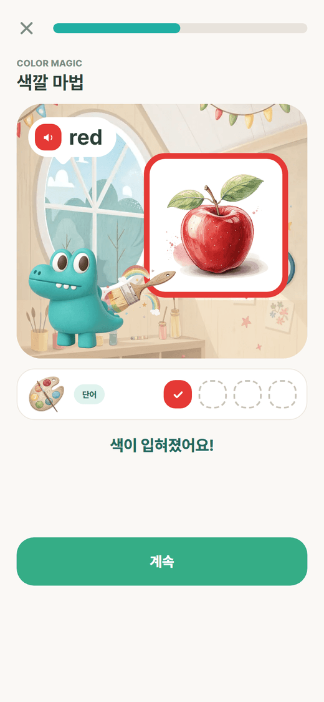
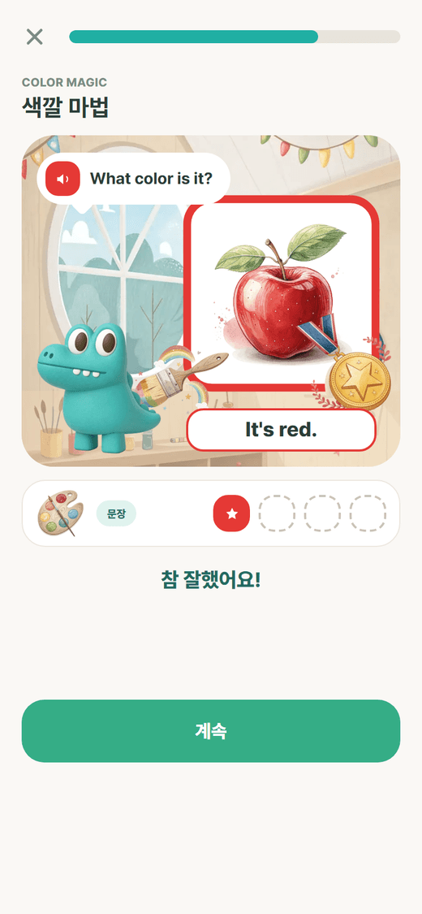
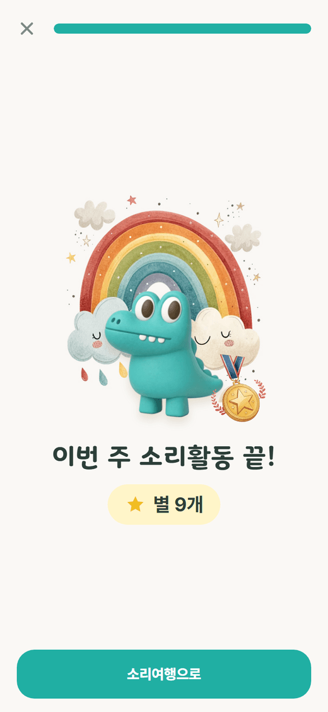
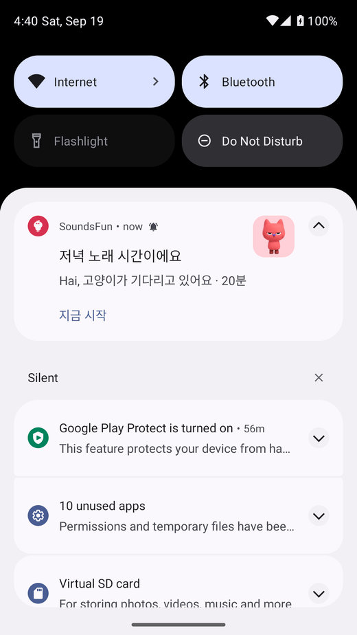
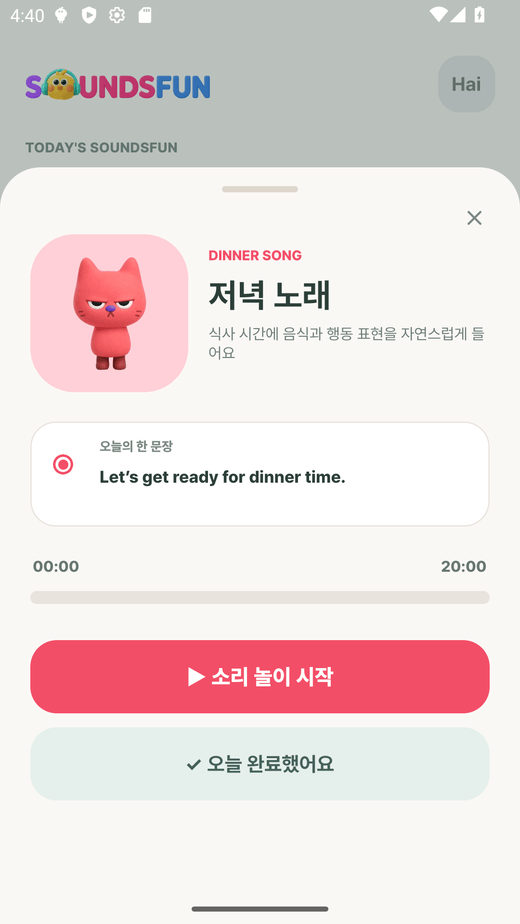

# 원칙 점검과 보완 설계

지원서의 **핵심 설계 원칙 8가지**와 **MVP 기능**을 지금 앱과 하나씩 대조하고, 빠진 것은 만들거나 설계했습니다. 이 문서에는 그 결과와 함께 새로 만든 말하기 게임 ‘색깔 마법’, 휴대폰 알림, 안드로이드 앱 설치 방법이 들어 있습니다.

## 1. 핵심 설계 원칙 점검

| # | 지원서 원칙 | 앱에 있는 것 | 상태 | 이번에 보완한 것 |
|---|---|---|---|---|
| 1 | 단계별·주제별 연계 교육과정 | 48주 4단계, 주차 콘텐츠는 JSON 한 벌, 영상 → 맞추기 → 말하기가 같은 단어로 이어짐 | 충족 | 단계 카드에 단계 아이콘, 주제 칩(이번 주 주제 강조, `W1–3`), 12주 눈금, 잠금 표시 |
| 2 | 자발적 참여를 부르는 게임형·보상형 | 단어 맞추기 4유형, 별, 스티커, 연속일 | 보완 | **말하기 게임 ‘색깔 마법’** 새로 설계 (아래 2장) |
| 3 | ‘많이’보다 ‘매일’: 출석·반복·작은 성취 | 번호 길, 같은 영상 한 주 반복, 요일 별, 주간 표, 연속일 | 충족 | 저녁 알림에 “연속 n일째! 하나만 해도 이어져요” |
| 4 | 같은 시간에 깨우는 알림 | 루틴별 시각, 끝낸 루틴은 안 보냄, 저녁 리마인드 | 보완 | **휴대폰 알림을 제대로** (아래 3장): 캐릭터 그림, 전용 아이콘, 정확한 시각, ‘지금 시작’ 버튼, 시험 버튼 |
| 5 | 공공 영어과정과 신앙과정의 분리 | 하잉RTA는 기본 꺼짐, 켤 때 확인 창, 주말에만 | 충족 | – |
| 6 | 저사양 스마트폰, 모바일 우선 | WebP 그림, 글꼴 줄임, 영상은 유튜브로 | 보완 | **데이터 아끼기**(저용량 모드): 시작 영상 대신 그림 |
| 7 | 개인정보 최소, 보호자 동의, 광고 없음 | 아이는 이름·연령만, 사진은 기기에만, 가입 때 동의, 광고·외부 분석 없음 | 충족 | 알림·마이크 권한 문구를 쉬운 말로 |
| 8 | 쉬운 한국어·그림 안내, 보호자 선택권 | 짧은 해요체, 캐릭터·아이콘 위주, 스위치로 선택 | 일부 | 다언어 안내는 설계만 (아래 5장) |

## 2. 말하기 게임 ‘색깔 마법 (Color Magic)’

지원서: “핵심은 영상에서 들은 영어를 직접 말하며 활용하는 과정을 게임 형태로 제공하는 것 … 어휘와 문장을 게임 속 말하기 활동에서 사용하도록 구성”.

### 놀이 방법

미술실에서 악어(‘오늘의 주제’ 캐릭터)가 캔버스 앞에 서 있습니다. 캔버스에는 **색이 없는 밑그림**이 있고, 아이가 색깔 말을 하면 그 색이 번지며 그림이 완성됩니다.

| 단계 | 아이가 듣는 말 | 아이가 하는 말 | 화면에서 일어나는 일 |
|---|---|---|---|
| 1. 단어 | `red` | “red” | 회색 사과에 빨강이 번진다. 별이 튀고 팔레트 한 칸이 찬다 |
| 2. 문장 | `What color is it?` → `It’s red.` | “It’s red.” | 완성된 그림에 칭찬 메달이 찍힌다 |

- 1주차 영상 *Red Yellow Green Blue*의 네 색을 그대로 씁니다: red–사과, yellow–해, green–클로버, blue–하늘.
- 문장 단계의 묻는 말은 ‘오늘의 주제’ 루틴의 한 문장(“What color is it? It’s red!”)과 같습니다. **영상 → 단어 → 문장**으로 이어집니다.
- 6세는 단어 단계만 합니다(`levelsByAge`). 7세부터 문장 단계가 붙습니다.
- 단어 단계가 끝나면 무지개 화면에서 “이번엔 문장으로 말해요”라고 알려 줍니다.






### 틀렸다는 말이 없는 규칙

| 상황 | 동작 |
|---|---|
| 잘 말함 (0.7 이상) | 색칠·메달, 별 1개 |
| 첫 번째에 안 됨 | “한 번 더?” 하고 다시 들려준다 |
| 두 번째도 안 됨 | 같이 다시 듣고 색을 입혀 준다 (`given`) |
| 마이크를 못 씀 | 도움 모드: 어른이 듣고 “말했어요”를 누른다 |
| 하기 싫음 | 건너뛰기 |

### 그림

| 그림 | 만든 방법 |
|---|---|
| 미술실 배경, 팔레트, 붓, 무지개, 메달 | Recraft AI (단어 그림과 같은 그림책 화풍) |
| 회색 밑그림 | 이번 주 단어 그림을 흑백으로 바꿔 자동 생성. 윤곽이 같아 색이 입혀지는 연출이 자연스럽다 |
| 악어 | 디자이너의 클레이 캐릭터 |
| 캔버스·말풍선·팔레트 칸·버튼 | 앱의 디자인 토큰(둥근 카드, 루틴 색)으로 직접 그림 |

### 데이터

`week1.json › activity.speakGame`에 제목, 묻는 말, 색–그림 짝, 나이별 단계가 있습니다. 차례는 순수 함수 `buildSpeakRounds()`가 만들고 단위 테스트가 있습니다. 기록에는 `mode`(word · sentence)가 추가되었고, 서버 `speak_attempts` 테이블도 `UNIQUE(activity_id, word_id, mode)`로 바뀌었습니다.

## 3. 휴대폰 알림

| 항목 | 내용 |
|---|---|
| 작은 아이콘 | 병아리 윤곽(눈이 뚫린 흰색 단색). 상태 표시줄에 뜬다 |
| 큰 그림 | 알림 오른쪽에 **그 루틴의 캐릭터**: 아침 병아리, 주제 악어, 저녁 고양이, 잠자리 토끼. 저녁 리마인드는 불꽃(연속일) 또는 달, 다 들었을 때는 별, 시험 알림은 종 |
| 색 | 루틴 색이 아이콘과 앱 이름에 입혀진다 |
| 문구 | 캐릭터가 아이를 부른다: “하이, 병아리가 기다리고 있어요 · 20분”. 날마다 돌아가며 바뀐다. 이모지는 쓰지 않는다 |
| 버튼 | ‘지금 시작’ — 누르면 앱이 열리고 그 루틴 시트가 뜬다 |
| 시각 | 정확한 알람 권한으로 정한 시각에 울린다. 재부팅 뒤에도 유지 |
| 보내지 않는 경우 | 이미 끝낸 루틴, 꺼 둔 루틴, 7일이 끝난 뒤 |
| 확인 | 설정 › 알림 시간 › **알림 시험해 보기** (5초 뒤 도착) |




에뮬레이터(안드로이드 13)에서 확인한 결과입니다: 정한 시각 정각에 도착했고, 버튼을 누르면 앱이 열리며 저녁 노래 시트가 떴습니다.

불꽃·종·달·별과 단계 아이콘은 Recraft AI로 만든 클레이 질감 아이콘이라 디자이너 캐릭터와 어울립니다. 큰 그림은 빌드할 때 `plugins/withNotificationArt.js`가 앱에 넣고, 알림마다 다른 그림을 고르는 부분은 `patches/expo-notifications+*.patch`로 넣었습니다. Expo는 모듈을 미리 컴파일된 파일로 가져다 쓰기 때문에, `package.json`의 `expo.autolinking.android.buildFromSource`에 `expo-notifications`를 적어 이 모듈만 소스에서 빌드하게 했습니다(안 그러면 패치가 빌드에 들어가지 않습니다).

## 4. 지원서의 MVP 기능 점검

| 지원서 MVP | 상태 | 내용 |
|---|---|---|
| 아동: 오늘의 영상 듣기 | 있음 | 번호 길, 루틴 시트 |
| 아동: 단어 듣고 따라 말하기 | 있음 → 강화 | 색깔 마법 (단어 → 문장) |
| 아동: 스티커·연속학습 기록 | 있음 | 스티커 판, 연속일 |
| 아동: 간단 진단 | 설계 | 아래 5장 |
| 보호자: 출석·완료율 확인 | 있음 | 오늘·주간·월간, 이번 주 한눈에 |
| 보호자: **어려운 항목 확인** | **이번에 추가** | 부모 탭 ‘어려워한 말’: 맞추기에서 틀렸거나 말하기에서 끝내 못 한 말을 많이 놓친 순서로 3개 |
| 보호자: **주 1회 대화 가이드** | **이번에 추가** | 부모 탭 ‘이번 주 대화’: 언제 · 묻는 말 · 대답 (예: 신호등 앞에서 “What color is it?” — “It’s green!”) |
| 운영자: 콘텐츠 점검·배정 | 설계 | 아래 5장 |
| 접근성: 쉬운 한국어, 그림 안내 | 있음 | – |
| 접근성: **저용량 모드** | **이번에 추가** | 설정 › 데이터 아끼기 |
| 접근성: 웹앱(PWA) 우선 | 있음 | GitHub Pages, 홈 화면에 추가 |
| 안드로이드 앱 | **이번에 추가** | 아래 6장 |

## 5. 아직 만들지 않은 것의 설계

### 간단 진단

| 항목 | 설계 |
|---|---|
| 언제 | 아이 등록 직후 한 번. 건너뛸 수 있다 |
| 무엇을 | 그림 고르기 4문제(이번 주 단어 2 + 다음 단계 단어 2). 기존 문제 엔진 `buildQuiz`를 그대로 쓴다 |
| 결과 | 점수가 아니라 **시작 난이도**: 보기 수(2 · 3 · 4)와 글자 표시 여부. 지금은 연령이 이 값을 정한다 |
| 저장 | `children.level`(easy · normal) 한 칸. 부모가 설정에서 바꿀 수 있다 |
| 원칙 | 아이에게 결과를 보여 주지 않는다. “준비됐어요!”만 |

### 다언어 안내

화면 문구는 모두 `shared/i18n/strings.ko.ts` 한 파일에 있습니다. `strings.<언어>.ts`를 같은 모양으로 더하고 설정에 ‘안내 언어’를 두면 됩니다. 우선 순위는 보호자 화면(가입·설정·부모 탭)입니다. 아이 화면은 글이 거의 없어 그림과 소리로 통합니다.

### 운영자 도구

| 기능 | 설계 |
|---|---|
| 링크 점검 | 매일 `week_routines.video_id`를 유튜브 oEmbed로 확인해 막힌 영상을 표시 |
| 대체 영상 | `week_routines`에 `fallback_video_id` 칸을 두고, 막히면 자동으로 바꾼다 |
| 과정 배정 | `children.run`, `weeks`로 이미 표현된다. 기관 단위 배정은 `groups` 테이블 추가 |

### 교사용 여러 아이 보기

`users` 아래에 아이가 여러 명 달릴 수 있게 이미 되어 있습니다(`children.user_id`). 교사 계정에 아이들을 연결하고, 리포트 API(`/children/{id}/report`)를 아이 수만큼 불러 표로 보여 주면 됩니다.

## 6. 안드로이드 앱 (갤럭시 노트 10+ 5G)

같은 코드에서 안드로이드 앱(APK)을 만듭니다. 웹과 달리 앱에서는 **알림이 앱을 닫아도 오고**, 음성 인식이 기기 기능으로 동작합니다.

```bash
cd apps/mobile
npx expo prebuild -p android --clean        # 안드로이드 프로젝트 생성 (android/ 는 저장소에 올리지 않는다)
cd android
set JAVA_HOME=C:\Program Files\Android\Android Studio\jbr
gradlew assembleRelease -PreactNativeArchitectures=arm64-v8a
# 결과: android/app/build/outputs/apk/release/app-release.apk
```

> 윈도우에서 `subst` 같은 가상 드라이브로 경로를 줄여 빌드하면 안 됩니다. 자동 링크가 실제 경로를 쓰기 때문에 경로가 둘로 갈려 실패합니다.

| 항목 | 값 |
|---|---|
| 패키지 | `kr.or.rta.soundsfun` |
| 대상 | arm64 (노트 10+ 5G), 안드로이드 7 이상 |
| 권한 | 알림, 정확한 알람, 재부팅 뒤 복원, 진동, 마이크(말하기 게임), 사진(선택) |
| 서명 | 시험용 키. 스토어에 올릴 때는 정식 키로 다시 서명 |

### 폰에 넣는 법

1. `app-release.apk`를 폰으로 보낸다(카카오톡 나에게 보내기, USB, 드라이브).
2. 폰에서 파일을 누른다 → “출처를 알 수 없는 앱 설치”를 허용한다.
3. 앱을 열고 가입 → 아이 등록 → 알림 허용.
4. 설정 › 알림 시간 › **알림 시험해 보기**로 알림이 오는지 확인한다.
5. 삼성 폰은 배터리 최적화가 알림을 늦출 수 있다: 설정 › 애플리케이션 › SoundsFun › 배터리 › **제한 없음**.
